# Step 2: Requirements & Plan

**📊 Progress:** Step 2 of 4

[Home](../../index.md) > [AI Ready Challenge](../../ai-ready-challenge.md) > [Step 2 - Requirements & Plan](./ifs-ready-step2-requirements.md)

- [⬅️ Previous: Step 1 - AI Strategy & Plan](./ifs-ready-step1-customer.md)
- [Next: Step 3 - Foundations ➡️](./ifs-ready-step3-foundations.md)

This section is part of the **IFS AI Ready Challenge**. Here, you'll capture and categorize all requirements—business outcomes, constraints, compliance, responsible AI guardrails, and operational needs—and map them to Azure Well-Architected Framework pillars.

---

```mermaid
flowchart LR
    A[🚀 Start] --> B[📝 Step 1:\nStrategy & Plan]
    B --> C[📋 Step 2:\nRequirements]
    C -->|Current| D[🏗️ Step 3:\nFoundations]
    D --> E[📊 Step 4:\nPresentation]
    style C fill:#90EE90,stroke:#333,stroke-width:2px
```

## 📋 Why Clear Requirements Matter

**Well-defined requirements are the key to successful AI projects.** Teams with structured requirements experience:

- **60% faster implementation** with clear scope and goals
- **40% reduction in rework** by addressing issues upfront
- **Better stakeholder alignment** through shared understanding
- **Reduced scope creep** with documented boundaries
- **Higher success rates** by focusing on achievable outcomes

[🔝 Back to Top](#step-2-requirements--plan)

### 📈 Benefits of Structured Requirements

| Benefit | With Clear Requirements | Without Clear Requirements |
|---------|------------------------|----------------------------|
| **Project Timeline** | Predictable delivery with fewer surprises | Extended timelines due to changing scope |
| **Budget Management** | Controlled costs within planned budget | Cost overruns from unclear expectations |
| **Team Alignment** | Everyone understands the goal | Confusion and conflicting priorities |
| **Quality Outcomes** | Focused solutions that meet needs | Misaligned solutions requiring rework |

[🔝 Back to Top](#step-2-requirements--plan)

---

## Prerequisites

What you need before starting:

- **Outputs from Step 1** (business outcomes and use cases)
- **45-60 minute team discussion** 
- **Basic understanding of current challenges**
- **One person to capture notes**
- **Key stakeholders available** for quick questions

[🔝 Back to Top](#step-2-requirements--plan)

---

## Objective

Capture what you need AI to do for IFS by documenting:
- Business outcomes and success measures
- Any constraints or limitations
- Security, compliance, and safety requirements
- Basic operational needs

[🔝 Back to Top](#step-2-requirements--plan)

---

## Activities (Simple 3-Step Process)

### Step A: Quick Requirements Brainstorm (20 minutes)
Review findings from **Step 1: AI Strategy & Plan** and discuss:

**Business Needs Checklist:**
- [ ] What specific business value must AI deliver?
- [ ] What are realistic timelines and budget constraints?
- [ ] What does success look like and how will we measure it?

**Technical & Operational Checklist:**
- [ ] Any performance expectations (speed, accuracy)?
- [ ] Security and compliance requirements?
- [ ] Integration needs with existing systems?
- [ ] Responsible AI and safety controls needed?

### Step B: Document Requirements (15 minutes)
Use the template below to capture your most important requirements (focus on top 5-10):

### Step C: Simple Prioritization (10 minutes)
Mark each requirement as:
- **Must Have** - Critical for success
- **Should Have** - Important but not blocking
- **Nice to Have** - Beneficial if time/budget allows

[🔝 Back to Top](#step-2-requirements--plan)

---

## Guidance

> **References:**
> - [CAF AI Plan phase](https://learn.microsoft.com/en-us/azure/cloud-adoption-framework/scenarios/ai/plan)
> - [Azure Well-Architected Framework](https://learn.microsoft.com/azure/well-architected/)
>
> **Pro Tips:**
> - Focus on the most important 5-10 requirements first
> - Use simple language everyone can understand
> - Ask "why" for each requirement to ensure it's necessary
> - Map requirements to simple categories: Security, Performance, Cost, Operations

**Example Requirements Table:**

| Requirement | Description | Priority | Category | Notes |
|-------------|-------------|----------|-----------|--------|
| Business Outcome | 10% reduction in fraudulent transactions | Must Have | Cost/Performance | Baseline: current fraud rate |
| Performance | Response time under 2 seconds | Must Have | Performance | User experience requirement |
| Security | All data encrypted | Must Have | Security | Regulatory compliance |
| Responsible AI | Bias testing for model outputs | Should Have | Security/Quality | Fairness requirement |
| Operations | 99.9% uptime monitoring | Nice to Have | Operations | Business hours initially |

### Common Requirement Categories (Simplified)

Instead of complex WAF mapping, use these simple categories:
- **Security & Compliance** - Data protection, regulatory requirements
- **Performance & Reliability** - Speed, accuracy, availability  
- **Cost & Operations** - Budget, monitoring, support

[🔝 Back to Top](#step-2-requirements--plan)

---

## Success Criteria

By the end of this step, you should have:
- **5-10 key requirements** documented in simple language
- **Clear priorities** (Must/Should/Nice to Have)
- **Basic categorization** for each requirement
- **Team agreement** on what matters most

### Validation Questions
- Does this make sense for our business?
- Is this realistic given our timeline and budget?
- Have we covered the essential requirements?
- Can we explain these requirements to leadership?

[🔝 Back to Top](#step-2-requirements--plan)

---

## Navigation
- [⬅️ Previous: Step 1 – AI Strategy & Plan](./ifs-ready-step1-customer.md)
- [Next: Step 3 – AI Solution Design ➡️](./ifs-ready-step3-foundations.md)
- [🏠 AI Ready Challenge Home](../../ai-ready-challenge.md)

---

## References & Supporting Evidence

The statistics and claims used in this document are based on the following industry research and reports:

### Requirements and Project Success
- **60% faster implementation with clear requirements**: [Project Management Institute - Pulse of the Profession](https://www.pmi.org/learning/thought-leadership/pulse)
- **40% reduction in rework**: [Standish Group CHAOS Report](https://www.standishgroup.com/sample_research_files/CHAOSReport2015-Final.pdf)
- **Project success correlation with requirements quality**: [IEEE Software Requirements Engineering](https://ieeexplore.ieee.org/document/requirements-engineering)

### Business Alignment and Planning
- **Stakeholder alignment benefits**: [Harvard Business Review - Project Success Factors](https://hbr.org/topic/subject/project-management)
- **Scope creep prevention**: [McKinsey Project Management Research](https://www.mckinsey.com/capabilities/operations/our-insights/project-management)

### Best Practices Framework
- [Cloud Adoption Framework for AI Planning](https://docs.microsoft.com/en-us/azure/cloud-adoption-framework/scenarios/ai/plan)
- [Azure Well-Architected Framework](https://docs.microsoft.com/en-us/azure/well-architected/)
- [Requirements engineering best practices](https://docs.microsoft.com/en-us/azure/architecture/framework/)

[🔝 Back to Top](#step-2-requirements--plan)