# Step 3: AI Platform Design

**📊 Progress:** Step 3 of 4

[Home](../../index.md) > [AI Ready Challenge](../../ai-ready-challenge.md) > [Step 3 - AI Platform Design](./ifs-ready-step3-foundations.md)

- [⬅️ Previous: Step 2 - Requirements & Plan](./ifs-ready-step2-requirements.md)
- [Next: Step 4 - Presentation ➡️](./ifs-ready-step4-present.md)

This section is part of the **IFS AI Ready Challenge**. Here, you'll design the AI Ready Azure Landing Zone platform environment that meets IFS's regulatory, compliance, and best practice requirements, providing the foundation for future AI workloads.

---

```mermaid
flowchart LR
    A[🚀 Start] --> B[📝 Step 1:\nStrategy & Plan]
    B --> C[📋 Step 2:\nRequirements]
    C --> D[🏗️ Step 3:\nFoundations]
    D -->|Current| E[📊 Step 4:\nPresentation]
    style D fill:#90EE90,stroke:#333,stroke-width:2px
```

## 🧰 Prerequisites

What you need before starting:

- **2-3 collaborative workshop sessions** (most teams complete this in 1-2 weeks)
- **Key team representatives** available for design discussions
- **Basic understanding of current Azure setup** (if any exists)
- **Requirements from Step 2** as input for design decisions

[🔝 Back to Top](#step-3-ai-platform-design)
- **Access to architecture documentation** (if available)

---

## Why Azure Landing Zones Are Essential

**Azure Landing Zones provide the foundation for successful AI initiatives.** Organizations with proper ALZ foundations experience:

- **70% faster AI deployments** with standardized patterns and automation
- **Reduced operational complexity** through consistent governance and monitoring
- **Built-in compliance** that prevents common regulatory issues
- **Team productivity gains** from self-service capabilities with guardrails
- **Cost optimization** through automated governance and resource management

### Success Stories

Teams using ALZ consistently report:
- "Deployment time reduced from weeks to days"
- "No more late-night troubleshooting calls"
- "Compliance audits became routine instead of stressful"
- "Developers can focus on AI innovation instead of infrastructure"

### Value by Team (Positive Outcomes)

| Team | How ALZ Helps | Typical Results |
|------|---------------|-----------------|
| **Network Team** | Standardized patterns, centralized control, predictable topology | 60% less manual configuration, consistent connectivity |
| **Security Team** | Built-in zero-trust, automated compliance, centralized monitoring | Automated compliance reporting, proactive threat detection |
| **Infrastructure Team** | Self-service with guardrails, standardization, automation | 70% faster deployments, reduced manual tasks |
| **Development Team** | Rapid provisioning, consistent environments | Focus on code instead of infrastructure, faster time-to-market |
| **Data Team** | Built-in data governance, automated classification | Data quality improvements, compliance by design |
| **AI Team** | Pre-configured AI services, embedded responsible AI | Accelerated AI adoption, ethical AI by default |

### Essential Foundation Components

The following ALZ components are **foundational** for IFS AI success:

✅ **Management Group hierarchy** with policy inheritance  
✅ **Azure Policy baselines** for compliance automation  
✅ **Hub-spoke network topology** with private endpoints  
✅ **Identity governance** with least-privilege access  
✅ **Monitoring and alerting** for operational excellence  
✅ **Resource organization** with consistent naming and tagging  

---

## Objective

Define a scalable, secure, and governed AI Ready Azure Landing Zone architecture by:
- Structuring management groups and subscriptions (platform vs application zones)
- Applying Azure Policy baselines for regulatory and compliance requirements
- Designing network topology and connectivity controls
- Establishing identity, access, and resource organization strategies
- Planning operational readiness (monitoring, management, and governance)

---

## Collaborative Design Activities

**Teams work together** to design the ALZ foundation that supports everyone's needs. This collaborative approach ensures successful AI deployment.

### Design Workshop Process (Recommended 2-3 Sessions)

**Session 1: Foundation Design (2 hours)**
- Review requirements from **Step 2: Requirements & Plan**
- **Collaborative design activities:**

  1. **Management Group Hierarchy Design:**
     - Work together to define platform and application workload organization
     - **Team validation:** Security and Infrastructure teams confirm the approach works
  
  2. **Subscription Strategy Planning:**
     - Map services and workloads to appropriate subscriptions collaboratively
     - **Team validation:** All teams confirm their workload placement makes sense

**Session 2: Governance & Security (2 hours)**
  
  3. **Policy Baselines Selection:**
     - Choose built-in and custom Azure Policy definitions together
     - **Essential policies:** Allowed locations, tag enforcement, diagnostic settings, private endpoints
     - **Team validation:** Security team confirms policies meet compliance needs
  
  4. **Network Topology Design:**
     - Design hub-and-spoke or virtual WAN with team input
     - Include private endpoints, DDoS protection, firewall controls
     - **Team validation:** Network team confirms topology supports requirements

**Session 3: Operations & Identity (1-2 hours)**
  
  5. **Identity & Access Controls Planning:**
     - Plan Entra ID, RBAC roles, and Managed Identities together
     - Focus on least-privileged access principles
     - **Team validation:** Security team confirms identity approach
  
  6. **Operational Planning:**
     - Design monitoring (Azure Monitor, Log Analytics), cost management, automation
     - **Team validation:** Operations team confirms approach supports ongoing management

### Team Collaboration Framework

| Team | Key Contributions | Collaboration Partners |
|------|-------------------|------------------------|
| **Security** | Policy definitions, RBAC design, compliance validation | Infrastructure, Network, Data teams |
| **Network** | Network topology, firewall rules, private endpoint strategy | Security, Infrastructure teams |
| **Infrastructure** | Subscription layout, resource organization, naming conventions | All teams for requirements validation |
| **Development** | Development workflow validation, environment requirements | Infrastructure, Security teams |
| **Data** | Data governance policies, classification requirements | Security, AI teams |
| **AI** | AI service requirements, responsible AI controls | Data, Security, Development teams |

---

## Guidance

> **References:**
> - [Azure Landing Zones Overview](https://learn.microsoft.com/en-us/azure/cloud-adoption-framework/ready/landing-zone/)
> - [AI Ready – CAF Landing Zone Processes](https://learn.microsoft.com/en-us/azure/cloud-adoption-framework/scenarios/ai/ready)
>
> **Management Groups & Subscriptions:**
> - Use separate management groups for regulatory boundaries (e.g., internet-facing vs internal).
> - Deploy platform services (identity, connectivity, management) in dedicated platform subscriptions.
>
> **Policy & Compliance:**
> - Assign policy initiatives for required standards (e.g., GDPR, HIPAA, ISO).
> - Enforce resource tagging and diagnostic settings at subscription scope.
>
> **Networking:**
> - Implement hub-and-spoke topology with Azure Firewall and DDoS protection.
> - Use private endpoints to secure PaaS resource access.
> - Deploy Web Application Firewall (WAF) for application layer protection and secure application delivery.
>
> **Identity:**
> - Use Entra ID for tenant-level identity and Managed Identities for resource access.
> - Plan RBAC roles at management group and subscription scopes.
>
> **Operations:**
> - Use Azure Policy and Azure Blueprints for repeatable landing zone deployment.
> - Set up monitoring and alerting with Log Analytics workspaces.

**Example Landing Zone Architecture Table:**

| Design Area        | Approach/Service                               | Purpose                                               |
|--------------------|------------------------------------------------|-------------------------------------------------------|
| Management Groups  | mgmt-platform, mgmt-app                        | Segment platform vs application governance            |
| Subscriptions      | sub-platform-id, sub-app-ai                    | Isolate shared vs AI workloads                        |
| Policy             | Allowed Locations, Tag Enforcement, Audit Logs | Enforce compliance and governance                     |
| Network            | Hub VNet + Spokes, Firewall, Private Endpoints | Secure connectivity and traffic inspection            |
| Application Delivery | Web Application Firewall, DDoS Protection    | Application layer security and availability protection |
| Identity           | Entra ID, RBAC, Managed Identities             | Least-privilege access and service identities         |
| Operations         | Log Analytics, Azure Monitor, Automation       | Monitor health, logs, and automate landing zone setup |

**Example Azure Policy Table:**

| Policy Definition                           | Purpose                                            | Assignment Scope               |
|---------------------------------------------|----------------------------------------------------|--------------------------------|
| Allowed locations                           | Restrict resource deployment to approved regions   | Mgmt Group or Subscription     |
| Require tag and its value                   | Enforce application of standard tags               | Subscription or Resource Group |
| Audit diagnostic settings                   | Ensure diagnostic logs are enabled for resources   | Subscription                   |
| Enforce resource naming conventions         | Standardize resource names for consistency         | Management Group               |
| Deny public network access on PaaS services | Block public endpoint creation for critical PaaS   | Subscription or Resource Group |

---

## Success Criteria & Team Alignment

**Meeting these criteria ensures your ALZ foundation will support successful AI deployment.**

### Key Deliverables

✅ **Management group and subscription layout diagram** - Validated by Infrastructure and Security teams  
✅ **Policy baseline assignments** covering regulatory & compliance controls  
✅ **Network topology diagram** showing secure connectivity - Confirmed by Network team  
✅ **Identity and access plan** with least-privileged operations - Validated by Security team  
✅ **Operational readiness plan** with monitoring, management, automation - Confirmed by Operations team  

### Team Validation Process

| Deliverable | Validation Partners | Success Indicators |
|-------------|-------------------|-------------------|
| Management Groups & Subscriptions | Infrastructure Lead, Security Lead | Clear isolation, logical boundaries, team agreement |
| Azure Policy Baselines | Security Team, Compliance Officer | Regulatory requirements covered, practical implementation |
| Network Design | Network Architect, Security Architect | Zero-trust principles, private connectivity, scalable design |
| Identity & Access | Security Lead, Identity Team | Least-privilege implemented, manageable access model |
| Operations Plan | Operations Manager, Monitoring Team | Comprehensive observability, automated alerting, sustainable operations |

### Team Alignment Checkpoint

**Before proceeding to Step 4, confirm team alignment:**

- [ ] ALZ design addresses each team's key requirements
- [ ] No significant blockers identified for workload deployment
- [ ] Operational model is clearly defined and achievable
- [ ] Security and compliance requirements are adequately addressed
- [ ] Cost governance approach is reasonable and sustainable

### Getting Started Tips

- **Start simple:** Begin with core components, enhance over time
- **Focus on essentials:** Implement must-have policies first, add nice-to-haves later
- **Leverage templates:** Use Azure Landing Zone reference architectures as starting points
- **Plan for growth:** Design for current needs but consider future scale

**✅ READY TO PROCEED:** When all teams confirm the design meets their needs and supports the AI initiatives.

---

## Navigation
- [⬅️ Previous: Step 2 - Requirements & Plan](./ifs-ready-step2-requirements.md)
- [Next: Step 4 - Presentation ➡️](./ifs-ready-step4-present.md)
- [🏠 AI Ready Challenge Home](../../ai-ready-challenge.md)

---

## References & Supporting Evidence

The statistics and claims used in this document are based on the following industry research and reports:

### Security & Compliance Statistics
- **70% of cloud security incidents from poor foundational controls**: [Microsoft Azure Security Benchmark](https://learn.microsoft.com/en-us/security/benchmark/azure/introduction)
- **€2.9M average data breach cost**: [IBM Cost of a Data Breach Report 2024](https://www.ibm.com/reports/data-breach)
- **GDPR fine information**: [GDPR.eu Fine Tracker](https://www.gdpr.eu/gdpr-fines-so-far/) and [European Data Protection Board](https://edpb.europa.eu/)

### Cost & Operational Impact
- **200-400% budget overruns for ungoverned projects**: [McKinsey Technology Trends 2024](https://www.mckinsey.com/capabilities/mckinsey-digital/our-insights/the-top-trends-in-tech)
- **70% faster deployments with standardization**: [Azure Customer Success Stories](https://azure.microsoft.com/en-us/case-studies/)
- **5-10x cost of retrofitting governance**: [Cloud Adoption Framework ROI Studies](https://learn.microsoft.com/en-us/azure/cloud-adoption-framework/strategy/business-outcomes/)

### Industry Best Practices
- **Azure Landing Zones methodology**: [Azure Cloud Adoption Framework](https://learn.microsoft.com/en-us/azure/cloud-adoption-framework/ready/landing-zone/)
- **Well-Architected Framework**: [Microsoft Azure Well-Architected Framework](https://learn.microsoft.com/en-us/azure/well-architected/)
- **AI governance research**: [Microsoft Responsible AI Principles](https://www.microsoft.com/en-us/ai/responsible-ai)

### Additional Resources
- [Azure Policy documentation](https://learn.microsoft.com/en-us/azure/governance/policy/)
- [Azure Blueprint samples](https://learn.microsoft.com/en-us/azure/governance/blueprints/samples/)
- [Cloud security best practices](https://learn.microsoft.com/en-us/azure/security/fundamentals/best-practices-and-patterns)
- [Azure Web Application Firewall documentation](https://learn.microsoft.com/en-us/azure/web-application-firewall/)
- [Azure DDoS Protection documentation](https://learn.microsoft.com/en-us/azure/ddos-protection/ddos-protection-overview)