# AI Agent Challenge Overview

[Home](../../index.md) > [AI Agent Challenge](../../ai-agent-challenge.md) > [Overview](./ifs-agent-overview.md)

- [Next: Step 1 - Principles ➡️](./ifs-agent-step1-principles.md)

Welcome to the **IFS AI Agent Challenge**. This challenge guides you through designing, deploying, and operationalizing an internal AI workload using Agentic AI principles, building on the foundation established in the AI Ready Challenge.

---

## Prerequisites

Before starting this challenge, ensure you have:

- **Completed AI Ready Challenge** with selected use cases and prioritized business outcomes
- **Azure Landing Zone foundation** established from Challenge 1
- **Access to internal stakeholders** for use case validation and requirements gathering
- **One selected use case** from the AI Ready Challenge for detailed implementation

[🔝 Back to Top](#ai-agent-challenge-overview)

---

## Challenge Context

**Internal Use Case Focus:** This workload addresses an internal use case within IFS, serving as a learning journey to build expertise with Azure AI before customer-facing engagements.

**Risk Minimization & Compliance:** Internal deployment provides a low-risk, low-regulatory path to AI innovation while building team confidence and readiness across organizations.

**Productivity Focus:** Generative AI serves as a productivity accelerator, augmenting internal users to work faster and smarter with intelligent automation.

**Agentic AI Principles:** Solutions must incorporate:
- **Automated collections of tasks** that work together seamlessly
- **Operation with or without human supervision** based on context and requirements
- **Agent-to-agent collaboration capabilities** enabling intelligent coordination
- **Chained processes** creating cohesive, intelligent systems that deliver business value

---

## XLR8 Challenge Journey

> [!NOTE]
> This AI Agent Challenge is the second in a series of three connected challenges that build upon each other to create a comprehensive AI solution for IFS.

### How the Three Challenges Connect

```mermaid
flowchart TB
    Ready["1️⃣ AI Ready Challenge
    Secure, governed Azure foundation"]
    Agent["2️⃣ AI Agent Challenge
    Internal RAG chatbot application"]
    Hub["3️⃣ AI Hub Challenge
    Centralized AI service management"]
    
    Ready --> Agent
    Agent --> Hub
    
    classDef ready fill:#0078D4,color:white,stroke:#0078D4,stroke-width:2px
    classDef agent fill:#107C10,color:white,stroke:#107C10,stroke-width:2px
    classDef hub fill:#8661C5,color:white,stroke:#8661C5,stroke-width:2px
    
    class Ready ready
    class Agent agent
    class Hub hub
```



### Your Role in the Journey

In this **AI Agent Challenge**, you'll build upon the AI foundation established in the first challenge:

1. **Building on the Foundation**: You'll deploy the RAG chatbot into the secure Azure Landing Zone created in Challenge 1
2. **Proves the Concept**: Your functional agent application demonstrates the practical value of the AI infrastructure
3. **Reveals Scaling Needs**: The lessons learned will directly inform the centralized AI Hub design in Challenge 3
    classDef agent fill:#107C10,color:white,stroke:#107C10,stroke-width:2px
    classDef hub fill:#8661C5,color:white,stroke:#8661C5,stroke-width:2px
    
    class Ready ready
    class Agent agent
    class Hub hub
```

**Progressive AI Journey:**
1. [**AI Ready Challenge ←**](../../ai-ready-challenge.md) - Established the secure Azure foundation that this challenge builds upon
2. **AI Agent Challenge (Current)** - Builds an internal RAG chatbot on the foundation
3. [**AI Hub Challenge →**](../../ai-hub-challenge.md) - Will create a centralized AI management platform based on lessons learned here

This challenge leverages the Azure Landing Zone created in the AI Ready Challenge as its foundation, ensuring security and governance while focusing on application functionality.

> For consistent terminology across all challenges, refer to the [**Shared Glossary →**](../../shared-glossary.md)

---

## Challenge Objectives

- Select and refine one AI use case from the AI Ready Challenge for internal deployment
- Design an Agentic AI solution that automates collections of tasks and processes
- Enable agent-to-agent collaboration and intelligent process chaining
- Focus on productivity acceleration for internal users and teams
- Integrate seamlessly with the Azure Landing Zone foundation from Challenge 1
- Plan and design Day 2 operations including monitoring, scaling, and governance

---

## Challenge Structure

This challenge is divided into six steps:

1. [Step 1: Agentic AI Principles & Patterns](./ifs-agent-step1-principles.md) – Learn foundational concepts and Azure multi-agent architecture patterns
2. [Step 2: Functional Requirements](./ifs-agent-step2-functional-requirements.md) – Capture intended capabilities and behaviors of the AI workload
3. [Step 3: Non-Functional Requirements](./ifs-agent-step3-nonfunctional-requirements.md) – Document scalability, performance, security, and compliance attributes
4. [Step 4: Solution Design](./ifs-agent-step4-solution-design.md) – Create workload architecture with Agentic AI patterns
5. [Step 5: Integration](./ifs-agent-step5-integration.md) – Deploy into Azure Landing Zone with Day 2 operations
6. [Step 6: Presentation](./ifs-agent-step6-presentation.md) – Share journey from use case to deployment and operations

---

## Challenge Workflow (Visual)


## How to Use This Challenge

- **Start with Step 1:** Begin by understanding Agentic AI principles and patterns
- **Build on Challenge 1:** Leverage the use cases and platform foundation from the AI Ready Challenge
- **Work as a team** to complete each step in order with collaborative design sessions
- **Focus on internal productivity** use cases that minimize risk while maximizing learning
- **Apply Agentic AI patterns** throughout your solution design and implementation
- **Use provided activities, guidance, and success criteria** to structure your work systematically
- **Document your findings and designs** for each step to build organizational knowledge

---

## Success Framework

### Key Success Indicators

✅ **Use Case Alignment:** Selected use case directly supports internal productivity goals  
✅ **Agentic Design:** Solution incorporates automated task collections and agent collaboration  
✅ **Platform Integration:** Seamless deployment into existing Azure Landing Zone foundation  
✅ **Operational Readiness:** Day 2 operations planned including monitoring and governance  
✅ **Team Learning:** Internal expertise built for future customer-facing initiatives  

### Learning Outcomes

By completing this challenge, teams will gain:
- **Hands-on experience** with Agentic AI patterns and implementation
- **Practical knowledge** of Azure AI services integration and deployment
- **Operational expertise** in managing AI workloads at scale
- **Confidence** to engage in customer-facing AI initiatives
- **Proven methodologies** for internal AI adoption and change management

---

## Navigation
- [Next: Step 1 - Principles ➡️](./ifs-agent-step1-principles.md)
- [🏠 AI Agent Challenge Home](../../ai-agent-challenge.md)
