# Step 1: Agentic AI Principles & Patterns

**📊 Progress:** Step 1 of 6
**⏱️ Estimated Time:** 1 hour

## Executive Summary
This foundational step introduces the key concepts, patterns, and architectures for building effective agentic AI systems. By understanding these principles, you'll establish the knowledge base required to design a sophisticated AI agent solution for IFS that goes beyond simple RAG implementations.

[Home](../../index.md) > [AI Agent Challenge](../../ai-agent-challenge.md) > [Step 1 - Agentic AI Principles & Patterns](./ifs-agent-step1-principles.md)

- [⬅️ Previous: Challenge Overview](./ifs-agent-overview.md)
- [Next: Step 2 - Functional Requirements ➡️](./ifs-agent-step2-functional-requirements.md)

This step provides essential understanding of Agentic AI principles and patterns needed for the IFS AI Agent Challenge. Complete this foundational learning before proceeding to the functional requirements in Step 2.

## Table of Contents
{:.no_toc}

* TOC
{:toc}

*Note: Generated using Jekyll's automatic table of contents feature*

---

```mermaid
flowchart LR
    A[🚀 Start] --> B[📚 Step 1 Principles]
    B -->|Current| C[📋 Step 2 Functional Req]
    C --> D[🔒 Step 3 Non-Functional Req]
    D --> E[🏗️ Step 4 Solution Design]
    E --> F[🔄 Step 5 Integration]
    F --> G[📊 Step 6 Presentation]
    style B fill:#90EE90,stroke:#333,stroke-width:2px
```

## 🤖 What is Agentic AI?

**Agentic AI** represents a paradigm shift from traditional AI systems that simply respond to queries, to intelligent systems that can autonomously plan, execute, and coordinate complex workflows. These systems operate as **digital agents** that can work independently or collaboratively to achieve business objectives.

### Key Characteristics

🤖 **Autonomous Operation:** Agents can operate with minimal human supervision  
🔗 **Task Orchestration:** Coordinate and execute collections of related tasks  
🤝 **Collaborative Intelligence:** Multiple agents work together toward common goals  
📋 **Goal-Oriented:** Focus on achieving specific business outcomes, not just responding to requests  
🔄 **Adaptive Workflow:** Can adjust approaches based on context and feedback  

---

## When to Use AI Agents?

Understanding when AI Agents are most effective helps in making informed decisions about when to implement agentic solutions versus traditional AI approaches.

AI Agents are best suited for the following types of use cases:

### 🎯 **Open-Ended Problems**

Allowing the LLM to determine needed steps to complete a task because it can't always be hardcoded into a workflow.

**Examples:**

- Dynamic troubleshooting where the solution path depends on discovered issues
- Creative problem-solving that requires flexible approaches
- Research tasks where the investigation path emerges based on findings

### 🔄 **Multi-Step Processes**

Tasks that require a level of complexity in which the AI Agent needs to use tools or information over multiple turns instead of single shot retrieval.

**Examples:**

- End-to-end customer onboarding workflows
- Complex data analysis requiring multiple data sources and analytical steps
- Document processing pipelines with validation and approval stages

### 📈 **Improvement Over Time**

Tasks where the agent can improve over time by receiving feedback from either its environment or users in order to provide better utility.

**Examples:**

- Personalized recommendation systems that learn from user interactions
- Quality assurance processes that adapt based on detected patterns
- Customer service solutions that refine responses based on satisfaction scores

### 💡 **When NOT to Use AI Agents**

While AI Agents offer powerful capabilities, they may not be the best choice for:

- **Simple, deterministic tasks** - Use traditional automation for straightforward, rule-based processes
- **Real-time, low-latency requirements** - Consider direct API calls or cached responses for immediate responses
- **High-risk, safety-critical operations** - Ensure human oversight for mission-critical decisions
- **Limited data scenarios** - Traditional ML models may perform better with constrained datasets

---

## Which are the options for Agent Development?

There are multiple frameworks and platforms available for building AI agents, each suited for different use cases and skill levels:

### 🏗️ **Professional Development Platforms**

- **Azure AI Foundry Agent Service** - Managed Azure service with enterprise security, multiple models, and data integration
- **Semantic Kernel** - Open-source SDK for building and orchestrating multi-agent solutions
- **Microsoft 365 Agents SDK** - Self-hosted agents for various channels (Teams, Slack, Messenger)

### 🔬 **Research & Experimentation**

- **AutoGen** - Open-source framework for rapid agent prototyping and research

### 👥 **Low-Code & Business User Solutions**

- **Microsoft Copilot Studio** - Visual, low-code environment for citizen developers
- **Copilot Studio Agent Builder** - Declarative agent creation for business users with no coding experience

### 🎯 **Choosing the Right Platform**

- **Business Users** → Copilot Studio Agent Builder for simple declarative agents
- **Citizen Developers** → Microsoft Copilot Studio for low-code solutions
- **Professional Developers** → Azure AI Foundry Agent Service for enterprise solutions
- **Multi-Agent Systems** → Semantic Kernel for orchestration and complex workflows

---

## Who is the Core Enabler for Agentic AI? -> Function calling

**Function calling** is the fundamental capability that enables Agentic AI systems. It allows Large Language Models to interact with external tools, APIs, and systems, transforming them from simple text generators into intelligent agents capable of taking actions in the real world.

### 🔧 **What is Function/Tool Calling?**

Function calling is the primary mechanism that enables Large Language Models (LLMs) to interact with tools. The terms 'Function' and 'Tool' are often used interchangeably because 'functions' (reusable blocks of code) are the 'tools' agents use to perform tasks.

For a function to be executed, the LLM compares the user's request against the function's description. A schema containing descriptions of all available functions is sent to the LLM. The LLM then selects the most appropriate function for the task and returns its name and arguments. The selected function is executed, its response is sent back to the LLM, and the LLM uses this information to respond to the user's request.

### **Core Elements Required for Function Calling:**

1. **An LLM model that supports function calling** - Not all models support this capability
2. **A schema containing function descriptions** - Detailed definitions including function name, purpose, required parameters, and expected outputs
3. **The code for each described function** - Actual implementation that performs the task

### **How Function Calling Enables Agents:**

- **Tool Integration** - Agents can invoke external functions, APIs, and services
- **Action Execution** - Move beyond text generation to perform concrete tasks  
- **Dynamic Workflows** - Chain multiple function calls to complete complex processes
- **Real-World Impact** - Interact with databases, send emails, process files, and more

Function calling bridges the gap between AI reasoning and practical implementation, making truly autonomous and useful AI agents possible.

## What Standard Enables AI Agent Tool Integration? -> Model Context Protocol (MCP)

**Model Context Protocol (MCP)** is an open standard that enables secure, controlled connections between AI applications and external data sources and tools. Created by Anthropic, MCP addresses the challenge of AI systems needing access to various data sources while maintaining security and standardization.

### 🔗 **What MCP Enables:**

- **Standardized Integration** - Unified protocol for connecting AI models to databases, APIs, and tools
- **Secure Access** - Controlled, permission-based access to sensitive data and systems
- **Interoperability** - Works across different AI platforms and applications
- **Simplified Development** - Reduces complexity of building AI integrations

### **Key MCP Components:**

- **MCP Servers** - Expose resources (data, tools, prompts) to AI applications
- **MCP Clients** - AI applications that consume MCP server resources
- **Protocol Standards** - Defined interfaces for secure communication

### **Deployment Options:**

- **Localhost** - Run MCP servers locally for development, testing, and personal use
- **Remote** - Deploy MCP servers to cloud or enterprise environments for production and team collaboration

MCP makes it easier to build robust, secure AI agent systems that can reliably access the data and tools they need to function effectively.

## How Function Calling and MCP Work Together

Function calling and MCP complement each other to enable powerful, secure AI agents:
- **Function Calling** allows LLMs to specify the actions and tools to be called based on user requests
- **MCP** provides a standardized, secure way for those functions to access external data and services

Together, they form the backbone of modern agentic AI systems, enabling intelligent, autonomous agents that can perform complex tasks while adhering to security and integration best practices.

## 

*Figure: Visual overview of how function calling and Model Context Protocol (MCP) work together to enable secure, standardized tool integration for AI agents. The diagram shows the flow from user request, through LLM function selection, to secure tool invocation via MCP.*

---

## Multi-Agent Architecture Patterns and Semantic Kernel

When designing agentic AI systems, several proven orchestration patterns enable effective collaboration and specialization among multiple agents. Each pattern addresses different coordination requirements and workflow characteristics.

With the Semantic Kernel SDK's agent orchestration framework, it is possible to design, manage, and scale complex multi-agent workflows without having to manually handle the details of agent coordination. Instead of relying on a single agent to manage every aspect of a task, you can combine multiple specialized agents. Each agent with a unique role or area of expertise can collaborate to create systems that are more robust, adaptive, and capable of solving real-world problems collaboratively.

### Why multi-agent orchestration matters
Single-agent systems are often limited in scope, constrained by one set of instructions or a single model prompt. Multi-agent orchestration addresses this limitation by allowing you to:

- Assign distinct skills, responsibilities, or perspectives to each agent.
- Combine outputs from multiple agents to improve decision-making and accuracy.
- Coordinate steps in a workflow so each agent’s work builds on the last.
- Dynamically route control between agents based on context or rules.

This approach opens the door to more flexible, efficient, and scalable solutions, especially for real-world applications that require collaboration, specialization, or redundancy.

### Multi-Agent Architecture Patterns

Semantic Kernel provides several orchestration patterns directly in the SDK, each offering a different approach to coordinating agents. These patterns are designed to be technology-agnostic so you can adapt them to your own domain and integrate them into your existing systems.

Regardless of which orchestration pattern you choose, the Semantic Kernel SDK provides a consistent, developer-friendly interface for building and running them. The typical flow looks like this:

Because all patterns share the same core interface, you can easily experiment with different orchestration strategies without rewriting agent logic or learning new APIs. The SDK abstracts the complexity of agent communication, coordination, and result aggregation so you can focus on designing workflows that deliver results.

#### 1. **Sequential Orchestration**

Chains AI agents in a predefined, linear order where each agent processes output from the previous agent.

- **Best for:** Step-by-step processing with clear dependencies
- **Examples:** Document processing pipelines, progressive refinement workflows
- **Link:** [Sequential Orchestration Pattern](https://learn.microsoft.com/en-us/azure/architecture/ai-ml/guide/ai-agent-design-patterns#sequential-orchestration)

#### 2. **Concurrent Orchestration**

Runs multiple AI agents simultaneously on the same task, allowing independent analysis from different perspectives.

- **Best for:** Tasks requiring diverse insights, time-sensitive parallel processing
- **Examples:** Multi-perspective analysis, ensemble reasoning, voting-based decisions
- **Link:** [Concurrent Orchestration Pattern](https://learn.microsoft.com/en-us/azure/architecture/ai-ml/guide/ai-agent-design-patterns#concurrent-orchestration)

#### 3. **Group Chat Orchestration**

Enables multiple agents to collaborate through shared conversation threads with a chat manager coordinating the flow.

- **Best for:** Collaborative brainstorming, structured validation, quality control processes
- **Examples:** Creative ideation, maker-checker loops, consensus building
- **Link:** [Group Chat Orchestration Pattern](https://learn.microsoft.com/en-us/azure/architecture/ai-ml/guide/ai-agent-design-patterns#group-chat-orchestration)

#### 4. **Handoff Orchestration**

Enables dynamic delegation of tasks between specialized agents based on context and requirements.

- **Best for:** Dynamic routing when optimal agent isn't known upfront
- **Examples:** Customer support escalation, specialized expertise routing
- **Link:** [Handoff Orchestration Pattern](https://learn.microsoft.com/en-us/azure/architecture/ai-ml/guide/ai-agent-design-patterns#handoff-orchestration)

#### 5. **Magentic Orchestration**

Designed for open-ended problems where agents build and refine task plans dynamically through collaboration.

- **Best for:** Complex problems without predetermined solution paths
- **Examples:** Incident response automation, adaptive problem-solving
- **Link:** [Magentic Orchestration Pattern](https://learn.microsoft.com/en-us/azure/architecture/ai-ml/guide/ai-agent-design-patterns#magentic-orchestration)

#### **Choosing the Right Pattern:**

- **Sequential** → Use when tasks follow a clear step-by-step order
- **Concurrent** → Use when you need multiple viewpoints or faster processing
- **Group Chat** → Use for team collaboration and validation workflows
- **Handoff** → Use when the best agent depends on the specific context
- **Magentic** → Use for complex problems without a predetermined approach

*Reference: 
- [Azure AI Agent Design Patterns](https://learn.microsoft.com/en-us/azure/architecture/ai-ml/guide/ai-agent-design-patterns)*
- [Semantic Kernel Agent Orchestration](https://learn.microsoft.com/en-us/semantic-kernel/frameworks/agent/agent-orchestration/?pivots=programming-language-csharp)*
### Semantic Kernel provides a unified orchestration workflow

---

## Summary

This step established the foundational knowledge needed to design and implement effective agentic AI systems for the IFS challenge. Here are the key takeaways:

### **Core Concepts Covered:**

🤖 **Agentic AI Definition** - Autonomous systems that plan, execute, and coordinate complex workflows beyond simple query responses

🎯 **When to Use AI Agents** - Best suited for open-ended problems, multi-step processes, and scenarios requiring improvement over time

🛠️ **Development Options** - Multiple platforms available from low-code (Copilot Studio) to enterprise solutions (Azure AI Foundry Agent Service and Semantic Kernel)

⚡ **Function Calling** - The fundamental enabler that allows LLMs to interact with external tools, APIs, and systems

🔗 **Model Context Protocol (MCP)** - Open standard for secure, standardized connections between AI applications and external resources

🏗️ **Architecture Patterns** - Five proven orchestration patterns for multi-agent coordination:
- **Sequential** for linear workflows
- **Concurrent** for parallel processing  
- **Group Chat** for collaborative discussion
- **Handoff** for dynamic routing
- **Magentic** for adaptive problem-solving

### **Key Insights for IFS Implementation:**

- **Start with Clear Use Cases** - Identify specific IFS scenarios that benefit from agent capabilities
- **Choose the Right Pattern** - Match orchestration patterns to your workflow requirements
- **Select the Technology SDK and Tools** - Choose development platforms (Azure AI Foundry, Semantic Kernel, etc.) and determine which functions and APIs your agents will need to access
- **Plan for Integration** - Consider how agents will connect to IFS systems using MCP standards
- **Design for Specialization** - Create focused agents rather than monolithic solutions

You're now ready to apply these principles to define functional requirements for the IFS AI Agent solution in Step 2.

---

## Success Criteria ✅

By the end of this step, you should:

- ✓ **Understand the fundamental concepts** of agentic AI and how they differ from traditional AI systems
- ✓ **Recognize the key patterns** for designing effective AI agents
- ✓ **Identify appropriate architectures** for different types of agent systems
- ✓ **Comprehend orchestration approaches** for coordinating multiple agents

To successfully complete this step, ensure you can explain these concepts to your team and apply them to the upcoming challenge requirements.

---

## Navigation
- [⬅️ Back to Challenge Overview](./ifs-agent-overview.md)
- [Next: Step 2 – Functional Requirements ➡️](./ifs-agent-step2-functional-requirements.md)
