# Step 1: Agentic AI Principles & Patterns

**📊 Progress:** Step 1 of 6
**⏱️ Estimated Time:** 1 hour

## Executive Summary
This foundational step introduces the key concepts, patterns, and architectures for building effective agentic AI systems. By understanding these principles, you'll establish the knowledge base required to design a sophisticated AI agent solution for IFS that goes beyond simple RAG implementations.

[Home](../../index.md) > [AI Agent Challenge](../../ai-agent-challenge.md) > [Step 1 - Agentic AI Principles & Patterns](./ifs-agent-step1-principles.md)

- [⬅️ Previous: Challenge Overview](./ifs-agent-overview.md)
- [Next: Step 2 - Functional Requirements ➡️](./ifs-agent-step2-functional-requirements.md)

This step provides essential understanding of Agentic AI principles and patterns needed for the IFS AI Agent Challenge. Complete this foundational learning before proceeding to the functional requirements in Step 2.

---

```mermaid
flowchart LR
    A[🚀 Start] --> B[📚 Step 1 Principles]
    B -->|Current| C[📋 Step 2 Functional Req]
    C --> D[🔒 Step 3 Non-Functional Req]
    D --> E[🏗️ Step 4 Solution Design]
    E --> F[🔄 Step 5 Integration]
    F --> G[📊 Step 6 Presentation]
    style B fill:#90EE90,stroke:#333,stroke-width:2px
```

## 🤖 What is Agentic AI?

**Agentic AI** represents a paradigm shift from traditional AI systems that simply respond to queries, to intelligent systems that can autonomously plan, execute, and coordinate complex workflows. These systems operate as **digital agents** that can work independently or collaboratively to achieve business objectives.

### Key Characteristics

🤖 **Autonomous Operation:** Agents can operate with minimal human supervision  
🔗 **Task Orchestration:** Coordinate and execute collections of related tasks  
🤝 **Collaborative Intelligence:** Multiple agents work together toward common goals  
📋 **Goal-Oriented:** Focus on achieving specific business outcomes, not just responding to requests  
🔄 **Adaptive Workflow:** Can adjust approaches based on context and feedback  

---

## Core Agentic AI Principles

### 1. **Automated Collections of Tasks**
* Agents orchestrate multiple steps in sequence to achieve goals
* Coordinate entire workflows rather than individual actions
* Maintain context across sequential operations

### 2. **Domain Knowledge Processing**
* Internalize and apply specialized knowledge bases
* Navigate complex information landscapes within focused domains
* Extract, synthesize, and interpret domain-specific information  

### 3. **Summarization & Critical Analysis**
* Aggregate large volumes of information into concise insights
* Identify significant patterns and outliers
* Synthesize conflicting viewpoints into coherent analyses

### 4. **Planning & Strategy Generation**
* Break down complex goals into sequenced action plans
* Anticipate contingencies with alternative approaches
* Balance execution speed vs. thoroughness tradeoffs

### 5. **Audience-Aware Content Generation**
* Adapt communication style to recipient needs
* Create outputs with appropriate depth, terminology, and format
* Recognize and respect audience boundaries and limitations

### 6. **Continuous Learning & Adaptation**
* Refine approaches based on success/failure patterns
* Update internal knowledge from interactions
* Progressive capability expansion over time

---

## Multi-Agent Architecture Patterns

When designing agentic AI systems, several architectural patterns enable effective collaboration and specialization among multiple agents:

### 1. **Hub-and-Spoke Pattern**
* **Central coordinator** agent directs specialized worker agents
* Simplifies workflow orchestration and responsibility delegation
* Creates clear accountability and coordination model

**Example:** Customer service supervisor (hub) routing inquiries to specialized representatives (spokes) based on query type.

### 2. **Assembly Line Pattern**
* Sequential processing between specialized agents
* Each agent has specific capability focus
* Output of one agent becomes input for next agent

**Example:** Legal document processing where specialists sequentially handle research, case analysis, brief drafting, and final review.

### 3. **Peer Network Pattern**
* Equal-authority agents collaborate on common problems
* Enables parallel processing of different tasks
* Flexible communication pathways between all agents

**Example:** Cross-functional product team with engineering, design, marketing, and customer success experts collaborating on product improvement.

### 4. **Hierarchical Pattern**
* Multi-level supervision and delegation
* Strategic planning at higher levels, tactical execution at lower levels
* Clear chain of command with escalation paths

**Example:** Corporate structure with strategic decisions at executive level, tactical planning at management level, and execution at worker level.

---

## Common Agent Roles

Agentic AI systems often employ specialized agents with defined roles:

### 1. **Planner/Orchestrator Agent**
* Plans overall workflow sequence
* Coordinates other agents' activities
* Maintains global context and goal alignment

### 2. **Research/Retrieval Agent**
* Gathers and organizes information
* Searches databases, knowledge bases, and documents
* Transforms unstructured data into usable context

### 3. **Reasoning/Analysis Agent**
* Applies logical inference
* Identifies patterns and insights
* Evaluates alternative approaches

### 4. **Creation/Generation Agent**
* Produces new content and artifacts
* Converts analytical insights into actionable outputs
* Designs solutions based on requirements

### 5. **Verification/QA Agent**
* Validates outputs against requirements
* Identifies errors or inconsistencies
* Ensures quality standards are met

### 6. **User Interaction Agent**
* Manages direct communication with humans
* Translates between technical and user-friendly language
* Gathers feedback and clarification

---

## RAG Architectural Patterns for Agents

Retrieval-Augmented Generation (RAG) integrates with agentic architectures in several ways:

### 1. **Multi-Stage RAG Pattern**

* **Decomposition:** Query is broken down into components
* **Multiple retrievals:** Different knowledge sources consulted
* **Progressive refinement:** Information aggregated across stages

### 2. **Recursive RAG Pattern**

* **Iterative improvement:** Agents recursively refine their knowledge
* **Self-guided research:** System determines what additional information is needed
* **Depth exploration:** Continues until confidence threshold reached

### 3. **Parallel RAG Pattern**

* **Specialized knowledge domains:** Different agents handle different topics
* **Concurrent processing:** Multiple retrievals happen simultaneously
* **Comprehensive coverage:** Ensures broad knowledge incorporation

---

## Specialized Agent Types

When designing agentic systems, consider these specialized agent patterns:

### 1. **Tool-Using Agents**

* Integrate with external systems and APIs
* Leverage specialized functions through defined interfaces
* Extend capabilities beyond built-in AI functions

### 2. **Memory-Augmented Agents**

* Maintain conversation context across interactions
* Store and retrieve relevant historical information
* Build knowledge graphs from accumulated interactions

### 3. **Reflective Agents**

* Critique their own outputs
* Iteratively improve responses through self-evaluation
* Implement internal testing and validation

---

## Success Criteria ✅

By the end of this step, you should:

- ✓ **Understand the fundamental concepts** of agentic AI and how they differ from traditional AI systems
- ✓ **Recognize the key patterns** for designing effective AI agents
- ✓ **Identify appropriate architectures** for different types of agent systems
- ✓ **Comprehend orchestration approaches** for coordinating multiple agents

To successfully complete this step, ensure you can explain these concepts to your team and apply them to the upcoming challenge requirements.

---

## Navigation
- [⬅️ Back to Challenge Overview](./ifs-agent-overview.md)
- [Next: Step 2 – Functional Requirements ➡️](./ifs-agent-step2-functional-requirements.md)
