# Step 2: Functional Requirements

**📊 Progress:** Step 2 of 6
**⏱️ Estimated Time:** 1 hour

## Executive Summary
This step focuses on understanding the business context and user requirements for the IFS Knowledge Assistant, an **agentic AI solution** that goes beyond traditional chatbots. By analyzing the scenario and identifying key functional needs, you'll establish a clear foundation for autonomous agents that can execute tasks, automate workflows, and deliver measurable business value to IFS employees and customers.

[Home](../../index.md) > [AI Agent Challenge](../../ai-agent-challenge.md) > [Step 2 - Functional Requirements](./ifs-agent-step2-functional-requirements.md)

- [⬅️ Previous: Step 1 - Principles](./ifs-agent-step1-principles.md) *(prerequisite)*
- [Next: Step 3 - Non-Functional Requirements ➡️](./ifs-agent-step3-nonfunctional-requirements.md)

This section is part of the **IFS AI Agent Challenge**. Here, you'll analyze the business scenario and user needs for the IFS Knowledge Assistant agentic AI system.

---

```mermaid
flowchart LR
    A[🚀 Start] --> B[📚 Step 1 Principles]
    B --> C[📋 Step 2 Functional Req]
    C -->|Current| D[🔒 Step 3 Non-Functional Req]
    D --> E[🏗️ Step 4 Solution Design]
    E --> F[🔄 Step 5 Integration]
    F --> G[📊 Step 6 Presentation]
    style C fill:#90EE90,stroke:#333,stroke-width:2px
```

## 🎯 Objective

Understand the business context, user needs, and high-level goals for the agentic AI solution that automates tasks, orchestrates workflows, and enables intelligent agent collaboration.

[🔝 Back to Top](#step-2-functional-requirements)

---

## 📝 Activities

- Review the scenario below.
- As a team, discuss and answer:
  1. **What are the main user needs and business drivers for the IFS Knowledge Assistant as an agentic AI solution?**
  2. **What autonomous tasks and workflows should the agents be able to execute?**
  3. **How will agents collaborate with each other and with human users?**
  4. **What are the high-level inputs, processes, and outputs for this agentic solution?**
  5. **What are the key constraints (e.g., private network, security, governance, compliance)?**
  6. **What measurable outcomes should the solution achieve (e.g., deflection rates, accuracy, productivity gains)?**

---

## Scenario
Innovate Financial Services (IFS) wants to empower its employees through **agentic AI** that autonomously handles complex workflows and business processes. They have decided to build the "IFS Knowledge Assistant", an intelligent agent system that goes beyond answering questions to actually executing tasks and automating workflows. This agentic solution needs to:

1. **Autonomously execute tasks** such as document analysis, compliance checks, and report generation
2. **Automate business workflows** including onboarding processes, policy reviews, and data analysis
3. **Collaborate with other agents** to handle multi-step processes requiring coordination
4. **Provide intelligent recommendations** and take action with or without human supervision based on context
5. **Maintain strict security and compliance** requirements while operating autonomously
6. **Scale to support thousands of employees** globally with measurable productivity gains
7. **Integrate with existing Azure infrastructure** and business systems for seamless operation

### Business Impact Goals
Inspired by real-world agentic AI deployments, IFS aims to achieve:
- **50%+ reduction in operational workload** for routine tasks
- **65%+ deflection rate** on service tickets through autonomous resolution
- **99%+ accuracy** in automated process execution
- **75% reduction in response latency** compared to manual processes

## Functional Requirements

### User Stories

As an IFS employee, I want to:

1. **Delegate complex tasks** to AI agents that can autonomously complete multi-step workflows
2. **Receive automated analysis** of documents with actionable insights and recommendations
3. **Collaborate with agents** that can coordinate with other specialized agents to solve complex problems
4. **Have agents execute tasks** on my behalf such as data collection, report generation, and compliance checks
5. **Monitor agent activity** and intervene when necessary while trusting autonomous execution for routine tasks
6. **Get proactive recommendations** from agents that analyze patterns and suggest process improvements
7. **Access the system securely** with my existing corporate credentials and appropriate role-based permissions
8. **See measurable productivity gains** from automated workflows and reduced manual effort

### System Capabilities

The IFS Knowledge Assistant agents must:

1. **Retrieve, process, and act on content** from:
   - SharePoint document libraries
   - Azure Storage accounts
   - HR policy documents
   - Financial procedure manuals
   - Market analysis reports
   - Internal wikis and knowledge bases
   - Live data from business systems via API integrations

2. **Understand and orchestrate**:
   - Natural language queries and commands
   - Multi-step business workflows and processes
   - Task dependencies and sequencing
   - Agent-to-agent collaboration requirements
   - Context from previous interactions and ongoing workflows

3. **Execute autonomous actions**:
   - Document analysis and summarization
   - Compliance verification and policy checks
   - Report generation and data aggregation
   - Workflow orchestration across multiple systems
   - Proactive monitoring and alerting
   - Task delegation to specialized agents

4. **Generate and deliver**:
   - Accurate, actionable responses with citations
   - Automated workflow results and status updates
   - Confidence scores and explanations for decisions
   - Follow-up recommendations and process improvements
   - Integration with business systems for seamless data flow

### Example Agentic Workflows

To illustrate the autonomous capabilities, consider these example workflows:

#### 📋 **Employee Onboarding Agent**
- **Trigger:** New employee added to HR system
- **Autonomous Actions:**
  1. Retrieve and analyze role-specific requirements
  2. Generate personalized onboarding checklist
  3. Provision access to required systems (delegated to security agent)
  4. Schedule training sessions and send calendar invitations
  5. Monitor completion status and send proactive reminders
  6. Escalate to HR if deadlines are missed
- **Collaboration:** Works with Security Agent, Training Agent, and Facilities Agent
- **Measurable Outcome:** 50% reduction in onboarding time, 99% completion accuracy

#### 📊 **Compliance Review Agent**
- **Trigger:** Quarterly compliance review cycle or policy update
- **Autonomous Actions:**
  1. Scan all relevant documents and transactions
  2. Identify potential compliance issues using policy rules
  3. Generate compliance reports with risk ratings
  4. Recommend corrective actions with priority levels
  5. Track remediation progress and update stakeholders
  6. Coordinate with Legal and Finance agents for approvals
- **Collaboration:** Works with Legal Agent, Finance Agent, and Audit Agent
- **Measurable Outcome:** 65% deflection of routine compliance queries, 75% faster review cycles

#### 💼 **Market Analysis Agent**
- **Trigger:** User request or scheduled market research cycle
- **Autonomous Actions:**
  1. Collect data from multiple financial data sources via APIs
  2. Analyze trends, patterns, and anomalies
  3. Generate comprehensive market analysis reports
  4. Identify investment opportunities or risks
  5. Coordinate with Risk Assessment agent for validation
  6. Deliver insights with confidence scores and supporting data
- **Collaboration:** Works with Risk Assessment Agent and Portfolio Management Agent
- **Measurable Outcome:** Real-time insights, 99% data accuracy, 80% time savings vs. manual analysis

[🔝 Back to Top](#step-2-functional-requirements)

### Integration Points

The solution must integrate with:

1. **Identity systems**:
   - Azure Entra ID for authentication
   - Role-based access controls for agent permissions
   - Delegation policies for autonomous actions

2. **Content repositories**:
   - SharePoint Online
   - Azure Blob Storage
   - Microsoft 365 applications
   - External data sources via secure APIs

3. **Business systems**:
   - HR systems for employee data and workflows
   - Finance systems for reporting and analysis
   - Compliance systems for policy enforcement
   - Project management tools for task tracking
   - Communication platforms (Teams, email) for notifications

4. **Security systems**:
   - Azure Key Vault for secret management
   - Azure Private Endpoints for secure connectivity
   - Logging and monitoring solutions for audit trails
   - Governance controls for agent actions and approvals

5. **AI orchestration platforms**:
   - Azure AI Foundry for agent development
   - Microsoft Copilot Studio for no-code/low-code agent creation
   - Azure OpenAI Service for language understanding
   - Azure AI Search for intelligent retrieval

6. **Frontend interfaces**:
   - Web application interface
   - Teams integration for collaborative workflows
   - Mobile accessibility (future phase)
   - API endpoints for system-to-system integration
   
[🔝 Back to Top](#step-2-functional-requirements)

---

## Success Criteria ✅

By the end of this step, you should have:

- ✓ **Identified the key business drivers** for the IFS Knowledge Assistant as an agentic AI solution
- ✓ **Documented core user needs** that go beyond question-answering to task automation and workflow orchestration
- ✓ **Defined autonomous capabilities** that agents should possess (e.g., task execution, workflow coordination)
- ✓ **Listed primary use cases** for agent collaboration and multi-step process automation
- ✓ **Identified integration requirements** with business systems for agent actions and data access
- ✓ **Established measurable success metrics** aligned with real-world agentic AI outcomes (deflection rates, accuracy, productivity gains)

To successfully complete this step, ensure you have a clear understanding of what the IFS Knowledge Assistant needs to accomplish as an **agentic AI system** that autonomously executes tasks and automates business workflows, not just as a question-answering chatbot.

---

## Navigation
- [⬅️ Previous: Step 1 - Principles](./ifs-agent-step1-principles.md)
- [Next: Step 3 - Non-Functional Requirements ➡️](./ifs-agent-step3-nonfunctional-requirements.md)
- [🏠 AI Agent Challenge Home](../../ai-agent-challenge.md)
