# Step 2: Functional Requirements

**📊 Progress:** Step 2 of 6
**⏱️ Estimated Time:** 1 hour

## Executive Summary
This step focuses on understanding the business context and user requirements for the IFS Knowledge Assistant. By analyzing the scenario and identifying key functional needs, you'll establish a clear foundation for your agentic AI solution that delivers tangible value to IFS employees and customers.

[Home](../../index.md) > [AI Agent Challenge](../../ai-agent-challenge.md) > [Step 2 - Functional Requirements](./ifs-agent-step2-functional-requirements.md)

- [⬅️ Previous: Step 1 - Principles](./ifs-agent-step1-principles.md) *(prerequisite)*
- [Next: Step 3 - Non-Functional Requirements ➡️](./ifs-agent-step3-nonfunctional-requirements.md)

This section is part of the **IFS AI Agent Challenge**. Here, you'll analyze the business scenario and user needs for the IFS Knowledge Assistant chatbot.

---

```mermaid
flowchart LR
    A[🚀 Start] --> B[📚 Step 1 Principles]
    B --> C[📋 Step 2 Functional Req]
    C -->|Current| D[🔒 Step 3 Non-Functional Req]
    D --> E[🏗️ Step 4 Solution Design]
    E --> F[🔄 Step 5 Integration]
    F --> G[📊 Step 6 Presentation]
    style C fill:#90EE90,stroke:#333,stroke-width:2px
```

## 🎯 Objective

Understand the business context, user needs, and high-level goals for the RAG chatbot solution.

[🔝 Back to Top](#step-2-functional-requirements)

---

## 📝 Activities

- Review the scenario below.
- As a team, discuss and answer:
  1. **What are the main user needs and business drivers for the IFS Knowledge Assistant?**
  2. **What are the high-level inputs, processes, and outputs for this solution?**
  3. **What are the key constraints (e.g., private network, Azure AI Search, security)?**

---

## Scenario
Innovate Financial Services (IFS) wants to empower its employees by providing quick and accurate answers to questions about internal policies, procedures, and market analysis reports. They have decided to build an internal web-based chatbot, the "IFS Knowledge Assistant". This application needs to:

1. Provide employees access to company information quickly and efficiently
2. Answer questions based on internal documents, policies, and procedures
3. Maintain strict security and compliance requirements
4. Scale to support thousands of employees globally
5. Integrate with existing Azure infrastructure and systems

## Functional Requirements

### User Stories

As an IFS employee, I want to:

1. **Ask natural language questions** about company policies and receive accurate answers
2. **Upload documents** that the system can then answer questions about
3. **See citations** for where information is sourced from
4. **Use the chatbot from my workspace** without having to access external systems
5. **Get relevant, contextualized answers** that account for my role and department
6. **Have conversation history preserved** during a session for context continuity
7. **Access the system securely** with my existing corporate credentials

### System Capabilities

The IFS Knowledge Assistant must:

1. **Retrieve and index content** from:
   - SharePoint document libraries
   - Azure Storage accounts
   - HR policy documents
   - Financial procedure manuals
   - Market analysis reports
   - Internal wikis and knowledge bases

2. **Process and understand**:
   - Natural language queries
   - Document context and relationships
   - User intent and search refinements

3. **Generate and deliver**:
   - Accurate, relevant responses
   - Source citations and confidence levels
   - Follow-up question suggestions
   - Document access links when appropriate

### Integration Points

The solution must integrate with:

1. **Identity systems**:
   - Azure Entra ID for authentication
   - Role-based access controls

2. **Content repositories**:
   - SharePoint Online
   - Azure Blob Storage
   - Microsoft 365 applications

3. **Security systems**:
   - Azure Key Vault for secret management
   - Azure Private Endpoints for secure connectivity
   - Logging and monitoring solutions

4. **Frontend interfaces**:
   - Web application interface   - Teams integration (future phase)
   - Mobile accessibility (future phase)
   
[🔝 Back to Top](#step-2-functional-requirements)

---

## Success Criteria ✅

By the end of this step, you should have:

- ✓ **Identified the key business drivers** for the IFS Knowledge Assistant
- ✓ **Documented core user needs** based on the scenario analysis
- ✓ **Defined primary use cases** that the agent should support
- ✓ **Listed integration requirements** with existing systems

To successfully complete this step, ensure you have a clear understanding of what the IFS Knowledge Assistant needs to accomplish from a business and user perspective.

---

## Navigation
- [⬅️ Previous: Step 1 - Principles](./ifs-agent-step1-principles.md)
- [Next: Step 3 - Non-Functional Requirements ➡️](./ifs-agent-step3-nonfunctional-requirements.md)
- [🏠 AI Agent Challenge Home](../../ai-agent-challenge.md)
