# Step 3: Non-Functional Requirements

**📊 Progress:** Step 3 of 6
**⏱️ Estimated Time:** 1 hour

## Executive Summary
This step focuses on the critical quality attributes and operational constraints that will ensure your AI agent solution is secure, compliant, and performant. By identifying and addressing non-functional requirements early, you'll build a robust solution that meets IFS's enterprise standards while delivering a superior user experience.

[Home](../../index.md) > [AI Agent Challenge](../../ai-agent-challenge.md) > [Step 3 - Non-Functional Requirements](./ifs-agent-step3-nonfunctional-requirements.md)

- [⬅️ Previous: Step 2 - Functional Requirements](./ifs-agent-step2-functional-requirements.md) *(prerequisite)*
- [Next: Step 4 - Solution Design ➡️](./ifs-agent-step4-solution-design.md)

This section is part of the **IFS AI Agent Challenge**. Here, you'll identify and document the business and technical requirements for the IFS Knowledge Assistant chatbot.

---

```mermaid
flowchart LR
    A[🚀 Start] --> B[📚 Step 1 Principles]
    B --> C[📋 Step 2 Functional Req]
    C --> D[🔒 Step 3 Non-Functional Req]
    D -->|Current| E[🏗️ Step 4 Solution Design]
    E --> F[🔄 Step 5 Integration]
    F --> G[📊 Step 6 Presentation]
    style D fill:#90EE90,stroke:#333,stroke-width:2px
```

## 🎯 Objective

Capture all critical requirements—business, technical, security, compliance, and operational—that must be addressed in your solution.

---

## 📝 Activities

- Review your findings from Step 2 (Functional Requirements).
- As a team, discuss and document:
  1. **🏆 Business Requirements:** What must the solution achieve for IFS to consider it a success?
  2. **⚙️ Technical Requirements:** What are the key technical needs?
  3. **🛡️ Security & Compliance:** What security, privacy, and compliance standards must be met?
  4. **Operational Requirements:** What are the support, monitoring, and management needs?

---

## Guidance

### Business Requirements

Consider aspects like:

1. **Cost Efficiency and ROI:**
   - Implementation costs should be offset by productivity gains within 12 months
   - Reduced time spent searching for information (target: 30% reduction)
   - Integration with existing IT investments to minimize additional expenditure

2. **User Adoption and Experience:**
   - Interface must be intuitive with minimal training needed
   - Response time must be under 3 seconds for standard queries
   - Accuracy rate of 90%+ for responses with high confidence scores

3. **Scalability and Growth:**
   - Support for 5,000+ global employees
   - Ability to expand knowledge domains without architecture redesign
   - Multi-language support (English initial phase, expansion later)

[🔝 Back to Top](#step-3-non-functional-requirements)

### Technical Requirements

Document requirements such as:

1. **Performance:**
   - Sub-3 second response time for 95% of queries
   - Support for 500+ concurrent users
   - 99.9% system availability during business hours
   - Efficient resource utilization with auto-scaling

2. **Scalability:**
   - Index capacity for 100,000+ documents (500GB+ of content)
   - Support for document additions of 1,000+ per month
   - Ability to scale to handle 25,000+ queries per day

3. **Resilience:**
   - Regional failover capabilities
   - No single point of failure in critical path
   - Graceful degradation under load

[🔝 Back to Top](#step-3-non-functional-requirements)

### Security & Compliance Requirements

Ensure you cover:

1. **Data Protection:**
   - All data must remain within approved Azure regions
   - All data at rest and in transit must be encrypted
   - No PII should be stored in logs or analytics
   - Private network connectivity only (no public internet exposure)

2. **Authentication & Authorization:**
   - Integration with Azure Entra ID
   - Role-based access control for different information categories
   - Comprehensive audit logs of all system access and usage
   - Secure service-to-service communication with managed identities

3. **Compliance:**
   - Adherence to financial industry regulations
   - Ability to exclude certain sensitive document types from indexing
   - Content filtering to prevent inappropriate responses
   - Content attribution for all responses

[🔝 Back to Top](#step-3-non-functional-requirements)

### Operational Requirements

Define needs for:

1. **Monitoring & Management:**
   - Comprehensive logging and monitoring solution
   - Real-time operational dashboards
   - Alerting for performance, security, or availability issues
   - Usage analytics and reporting capabilities

2. **Support & Maintenance:**
   - Automated deployment pipeline for updates
   - Regular model retraining and content refreshing
   - Clear versioning and rollback capabilities
   - Knowledge management processes for content governance

3. **Governance:**
   - Process for content approval and review
   - Continuous relevancy assessment of indexed materials
   - User feedback collection and analysis
   - Regular security and compliance reviews

[🔝 Back to Top](#step-3-non-functional-requirements)

---

## Success Criteria ✅

By the end of this step, you should have:

- ✓ **Documented security and compliance requirements** specific to IFS's industry and data types
- ✓ **Defined performance metrics** including response times, throughput, and availability targets
- ✓ **Identified responsible AI controls** needed to ensure ethical and trustworthy operation
- ✓ **Specified operational requirements** for monitoring, management, and maintenance
- ✓ **Established disaster recovery parameters** including RPO/RTO and business continuity needs

To successfully complete this step, ensure all non-functional requirements are clearly documented and prioritized for incorporation into your solution design.

---

## Navigation
- [⬅️ Previous: Step 2 - Functional Requirements](./ifs-agent-step2-functional-requirements.md)
- [Next: Step 4 - Solution Design ➡️](./ifs-agent-step4-solution-design.md)
- [🏠 AI Agent Challenge Home](../../ai-agent-challenge.md)
