# Step 4: Solution Design

**📊 Progress:** Step 4 of 6

[Home](../../index.md) > [AI Agent Challenge](../../ai-agent-challenge.md) > [Step 4 - Solution Design](./ifs-agent-step4-solution-design.md)

- [⬅️ Previous: Step 3 - Non-Functional Requirements](./ifs-agent-step3-nonfunctional-requirements.md)
- [Next: Step 5 - Integration ➡️](./ifs-agent-step5-integration.md)

This section is part of the **IFS AI Agent Challenge**. Here, you'll design the end-to-end architecture for the IFS Knowledge Assistant chatbot, ensuring alignment with Azure best practices and the Baseline OpenAI E2E Chat reference architecture.

---



```mermaid
flowchart LR
    A[🚀 Start] --> B[📚 Step 1:\nPrinciples]
    B --> C[📋 Step 2:\nFunctional Req]
    C --> D[🔒 Step 3:\nNon-Functional Req]
    D --> E[🏗️ Step 4:\nSolution Design]
    E -->|Current| F[🔄 Step 5:\nIntegration]
    F --> G[📊 Step 6:\nPresentation]
    style E fill:#90EE90,stroke:#333,stroke-width:2px
```

## 🎯 Objective

Define the architecture, controls, and Azure services needed for a robust, secure, and scalable RAG solution.

[🔝 Back to Top](#step-4-solution-design)

---

## 📝 Activities

- Review your requirements from Step 3.
- As a team, design and document:
  1. **🏗️ Architecture Diagram:** Sketch a high-level diagram of the RAG solution (UI, orchestration, retrieval, LLM backend, networking, identity, security, monitoring, etc.)
  2. **Azure Services:** List and justify the core Azure services and controls you will use (e.g., App Service, AI Search, OpenAI, Key Vault, Log Analytics).
  3. **Security & Governance:** Describe how you will enforce governance, compliance, and security (e.g., policies, private endpoints, managed identities).
  4. **Operational Readiness:** Outline how you will monitor, manage, and support the environment.
  5. **Reliability & Performance:** How will you ensure high availability, redundancy, and performance for the RAG workload?
  6. **Networking:** What network topologies and controls will you use to secure and connect RAG components?
  7. **Deployment:** How will you use IaC and CI/CD to automate deployment and updates?

---

## Reference Architecture

Use the baseline Azure OpenAI RAG architecture as your starting point, then adapt and enhance:


## Design Considerations

Consider these key aspects for your design:

### 1. Application Architecture

* **Web Frontend:** How will users interact with the solution?
* **API Backend:** What APIs will you expose, and how will they be secured?
* **Orchestration Layer:** How will you handle RAG workflow orchestration?

### 2. AI Components

* **Azure OpenAI Service:** Which models and deployments will you use?
* **Azure AI Search:** How will you configure indexes and semantic search features?
* **Vector Storage:** How will you implement and optimize vector search capabilities?

### 3. Data Architecture

* **Ingestion Pipeline:** How will documents flow into the system?
* **Storage Strategy:** Where and how will source documents be stored?
* **Chunking & Embedding:** What strategies will you use for optimal retrieval?

### 4. Security Architecture

* **Network Security:** How will you implement isolation and segmentation?
* **Identity & Access:** How will you manage authentication and authorization?
* **Secrets Management:** How will you protect sensitive configuration and keys?

### 5. Operational Architecture

* **Monitoring Strategy:** How will you gain visibility into system performance?
* **Alerting & Incident Response:** How will you detect and respond to issues?
* **Management & Updates:** How will you manage the solution lifecycle?

---

## Template for Your Design Document

```
## IFS Knowledge Assistant Solution Architecture

### Architecture Overview
[Insert your architecture diagram and description here]

### Key Components

#### 1. Frontend Layer
* Services: [List services]
* Key features: [List key features]
* Security controls: [List security measures]

#### 2. Application Layer
* Services: [List services]
* Key features: [List key features]
* Security controls: [List security measures]

#### 3. AI Services Layer
* Services: [List services]
* Key features: [List key features]
* Security controls: [List security measures]

#### 4. Data Layer
* Services: [List services]
* Key features: [List key features]
* Security controls: [List security measures]

### Security & Governance
[Describe your comprehensive security approach]

### Operational Management
[Describe your operational approach]

### Deployment Strategy
[Outline your deployment approach]
```

---

## Navigation
- [⬅️ Previous: Step 3 - Non-Functional Requirements](./ifs-agent-step3-nonfunctional-requirements.md)
- [Next: Step 5 - Integration ➡️](./ifs-agent-step5-integration.md)
- [🏠 AI Agent Challenge Home](../../ai-agent-challenge.md)
