# Step 4: Solution Design

**📊 Progress:** Step 4 of 6
**⏱️ Estimated Time:** 2 hours

## Executive Summary
This is the core technical design phase where you'll architect a sophisticated agentic AI solution for IFS. Building on your requirements analysis, you'll create a comprehensive architecture that leverages Azure AI services, implements multi-agent patterns, and ensures enterprise-grade security and scalability.

[Home](../../index.md) > [AI Agent Challenge](../../ai-agent-challenge.md) > [Step 4 - Solution Design](./ifs-agent-step4-solution-design.md)

- [⬅️ Previous: Step 3 - Non-Functional Requirements](./ifs-agent-step3-nonfunctional-requirements.md) *(prerequisite)*
- [Next: Step 5 - Integration ➡️](./ifs-agent-step5-integration.md)

This section is part of the **IFS AI Agent Challenge**. Here, you'll design the end-to-end architecture for the IFS Knowledge Assistant chatbot, ensuring alignment with Azure best practices and the Baseline OpenAI E2E Chat reference architecture.

---



```mermaid
flowchart LR
    A[🚀 Start] --> B[📚 Step 1 Principles]
    B --> C[📋 Step 2 Functional Req]
    C --> D[🔒 Step 3 Non-Functional Req]
    D --> E[🏗️ Step 4 Solution Design]
    E -->|Current| F[🔄 Step 5 Integration]
    F --> G[📊 Step 6 Presentation]
    style E fill:#90EE90,stroke:#333,stroke-width:2px
```

## 🎯 Objective

> [!NOTE]
> This is the most technical step of the challenge. Involve architects, developers, and security specialists in your design sessions to ensure comprehensive coverage of all aspects.

Define the architecture, controls, and Azure services needed for a robust, secure, and scalable RAG solution.

[🔝 Back to Top](#step-4-solution-design)

---

## Cross-Challenge Connection

> [!TIP]
> Your RAG chatbot design must align with the Azure Landing Zone from Challenge 1 and will inform the AI Hub architecture in Challenge 3.

**Related Components in Other Challenges:**
- This solution will deploy into the foundation created in [AI Ready Challenge - Foundations Design](../../01-aiready/ifs-ready-step3-foundations.md)
- The lessons from this implementation will guide the design of [AI Hub Challenge - Design](../../03-aihub/ifs-aihub-step3-design.md)

When designing your solution, consider how it would fit into a centralized AI Hub architecture that serves multiple applications.

---

## 📝 Activities

- Review your requirements from Step 3.
- As a team, design and document:
  1. **🏗️ Architecture Diagram:** Sketch a high-level diagram of the RAG solution (UI, orchestration, retrieval, LLM backend, networking, identity, security, monitoring, etc.)
  2. **Azure Services:** List and justify the core Azure services and controls you will use (e.g., App Service, AI Search, OpenAI, Key Vault, Log Analytics).
  3. **Security & Governance:** Describe how you will enforce governance, compliance, and security (e.g., policies, private endpoints, managed identities).
  4. **Operational Readiness:** Outline how you will monitor, manage, and support the environment.
  5. **Reliability & Performance:** How will you ensure high availability, redundancy, and performance for the RAG workload?
  6. **Networking:** What network topologies and controls will you use to secure and connect RAG components?
  7. **Deployment:** How will you use IaC and CI/CD to automate deployment and updates?

---

## Reference Architecture

Use the baseline Azure OpenAI RAG architecture as your starting point, then adapt and enhance:


## Design Considerations

Consider these key aspects for your design:

### 1. Application Architecture

* **Web Frontend:** How will users interact with the solution?
* **API Backend:** What APIs will you expose, and how will they be secured?
* **Orchestration Layer:** How will you handle RAG workflow orchestration?

### 2. AI Components

* **Azure OpenAI Service:** Which models and deployments will you use?
* **Azure AI Search:** How will you configure indexes and semantic search features?
* **Vector Storage:** How will you implement and optimize vector search capabilities?

> [!TIP]
> Example Azure OpenAI configuration in Bicep:
> 
> ```bicep
> resource openAiService 'Microsoft.CognitiveServices/accounts@2023-05-01' = {
>   name: openAiServiceName
>   location: location
>   kind: 'OpenAI'
>   sku: {
>     name: 'S0'
>   }
>   properties: {
>     customSubDomainName: openAiServiceName
>     publicNetworkAccess: 'Disabled'
>     networkAcls: {
>       defaultAction: 'Deny'
>       virtualNetworkRules: [
>         {
>           id: webAppSubnet.id
>           ignoreMissingVnetServiceEndpoint: false
>         }
>       ]
>     }
>   }
> }
> 
> resource gpt4Deployment 'Microsoft.CognitiveServices/accounts/deployments@2023-05-01' = {
>   parent: openAiService
>   name: 'gpt-4o'
>   properties: {
>     model: {
>       name: 'gpt-4o'
>       version: '2024-05-13'
>     }
>     scaleSettings: {
>       capacity: 10
>     }
>   }
> }
> 
> resource embeddingDeployment 'Microsoft.CognitiveServices/accounts/deployments@2023-05-01' = {
>   parent: openAiService
>   name: 'text-embedding-3-small'
>   properties: {
>     model: {
>       name: 'text-embedding-3-small'
>       version: '2024-03-01-preview'
>     }
>     scaleSettings: {
>       capacity: 10
>     }
>   }
> }
> ```

### 3. Data Architecture

* **Ingestion Pipeline:** How will documents flow into the system?
* **Storage Strategy:** Where and how will source documents be stored?
* **Chunking & Embedding:** What strategies will you use for optimal retrieval?

> [!TIP]
> Example configuration for document chunking strategy in Azure App Configuration:
>
> ```yaml
> # appconfig-chunking-strategy.yaml
> chunking:
>   strategy: "recursive"
>   chunk_size: 1000
>   chunk_overlap: 200
>   separators:
>     - "\n\n"
>     - "\n"
>     - " "
>     - ""
>   metadata_includes:
>     - "source"
>     - "page"
>     - "section"
>   additional_metadata:
>     organization: "IFS"
>     sensitivity: "internal"
>     content_type: "documentation"
>
> embedding:
>   model: "text-embedding-3-small"
>   dimensions: 1536
>   vector_store: "azure-ai-search"
> ```

### 4. Security Architecture

> [!WARNING]
> Security is critical for AI agent systems. Inadequate security controls can lead to data leakage, unauthorized access to AI capabilities, and compliance violations.

* **Network Security:** How will you implement isolation and segmentation?
* **Identity & Access:** How will you manage authentication and authorization?
* **Secrets Management:** How will you protect sensitive configuration and keys?

### 5. Operational Architecture

* **Monitoring Strategy:** How will you gain visibility into system performance?
* **Alerting & Incident Response:** How will you detect and respond to issues?
* **Management & Updates:** How will you manage the solution lifecycle?

---

## Template for Your Design Document

```
## IFS Knowledge Assistant Solution Architecture

### Architecture Overview
[Insert your architecture diagram and description here]

### Key Components

#### 1. Frontend Layer
* Services: [List services]
* Key features: [List key features]
* Security controls: [List security measures]

#### 2. Application Layer
* Services: [List services]
* Key features: [List key features]
* Security controls: [List security measures]

#### 3. AI Services Layer
* Services: [List services]
* Key features: [List key features]
* Security controls: [List security measures]

#### 4. Data Layer
* Services: [List services]
* Key features: [List key features]
* Security controls: [List security measures]

### Security & Governance
[Describe your comprehensive security approach]

### Operational Management
[Describe your operational approach]

### Deployment Strategy
[Outline your deployment approach]

<!-- tabs -->
# [Azure DevOps](#tab/azure-devops)

```yaml
# azure-pipelines.yml
trigger:
  branches:
    include:
    - main
    - release/*

pool:
  vmImage: 'ubuntu-latest'

stages:
- stage: Build
  jobs:
  - job: BuildJob
    steps:
    - task: DotNetCoreCLI@2
      displayName: 'Build Application'
      inputs:
        command: 'build'
        projects: '**/*.csproj'
    
    - task: DotNetCoreCLI@2
      displayName: 'Publish Application'
      inputs:
        command: 'publish'
        publishWebProjects: true
        arguments: '--configuration Release --output $(Build.ArtifactStagingDirectory)'
        zipAfterPublish: true
    
    - task: PublishBuildArtifacts@1
      displayName: 'Publish Artifacts'
      inputs:
        PathtoPublish: '$(Build.ArtifactStagingDirectory)'
        ArtifactName: 'drop'
        publishLocation: 'Container'

- stage: Deploy
  dependsOn: Build
  jobs:
  - job: DeployJob
    steps:
    - task: AzureResourceManagerTemplateDeployment@3
      displayName: 'Deploy Infrastructure'
      inputs:
        deploymentScope: 'Resource Group'
        azureResourceManagerConnection: 'Azure Connection'
        subscriptionId: '$(subscriptionId)'
        action: 'Create Or Update Resource Group'
        resourceGroupName: '$(resourceGroupName)'
        location: '$(location)'
        templateLocation: 'Linked artifact'
        csmFile: '$(Pipeline.Workspace)/drop/infra/main.bicep'
        overrideParameters: '-environmentName $(environment)'
        deploymentMode: 'Incremental'
    
    - task: AzureWebApp@1
      displayName: 'Deploy Web App'
      inputs:
        azureSubscription: 'Azure Connection'
        appType: 'webApp'
        appName: '$(webAppName)'
        package: '$(Pipeline.Workspace)/drop/**/*.zip'
        deploymentMethod: 'auto'
```

# [GitHub Actions](#tab/github-actions)

```yaml
# .github/workflows/deploy.yml
name: Build and Deploy

on:
  push:
    branches:
      - main
      - release/*
  workflow_dispatch:

jobs:
  build:
    runs-on: ubuntu-latest
    
    steps:
    - uses: actions/checkout@v3
    
    - name: Setup .NET
      uses: actions/setup-dotnet@v3
      with:
        dotnet-version: '7.0.x'
    
    - name: Build
      run: dotnet build --configuration Release
    
    - name: Publish
      run: dotnet publish -c Release -o ${{env.DOTNET_ROOT}}/app
    
    - name: Upload artifact
      uses: actions/upload-artifact@v3
      with:
        name: app
        path: ${{env.DOTNET_ROOT}}/app

  deploy:
    needs: build
    runs-on: ubuntu-latest
    environment: production
    
    steps:
    - uses: actions/checkout@v3
    
    - name: Download artifact
      uses: actions/download-artifact@v3
      with:
        name: app
        path: app
        
    - name: Login to Azure
      uses: azure/login@v1
      with:
        creds: ${{ secrets.AZURE_CREDENTIALS }}
        
    - name: Deploy Bicep
      uses: azure/arm-deploy@v1
      with:
        subscriptionId: ${{ secrets.AZURE_SUBSCRIPTION }}
        resourceGroupName: ${{ secrets.AZURE_RG }}
        template: ./infra/main.bicep
        parameters: environmentName=${{ secrets.ENVIRONMENT_NAME }}
        
    - name: Deploy Web App
      uses: azure/webapps-deploy@v2
      with:
        app-name: ${{ secrets.WEBAPP_NAME }}
        package: app
```

# [Azure CLI](#tab/azure-cli)

```bash
#!/bin/bash
# deploy.sh

# Variables
RESOURCE_GROUP="rg-ai-agent-prod"
LOCATION="eastus"
APP_NAME="ai-agent-app"
COSMOS_ACCOUNT="ai-agent-cosmos"
SEARCH_SERVICE="ai-agent-search"
OPENAI_SERVICE="ai-agent-openai"

# Create Resource Group if it doesn't exist
az group create --name $RESOURCE_GROUP --location $LOCATION

# Deploy Bicep template
az deployment group create \
  --resource-group $RESOURCE_GROUP \
  --template-file ./infra/main.bicep \
  --parameters environmentName=prod \
                 appName=$APP_NAME \
                 cosmosAccountName=$COSMOS_ACCOUNT \
                 searchServiceName=$SEARCH_SERVICE \
                 openAiServiceName=$OPENAI_SERVICE

# Build and publish the app
dotnet publish -c Release -o ./publish

# Deploy the app to App Service
cd ./publish
zip -r site.zip .
az webapp deployment source config-zip \
  --resource-group $RESOURCE_GROUP \
  --name $APP_NAME \
  --src site.zip
```
<!-- tab end -->
```

---

## Success Criteria ✅

By the end of this step, you should have:

- ✓ **Created a comprehensive architecture diagram** showing all components of your solution
- ✓ **Designed the agent orchestration approach** with clearly defined agent roles and interactions
- ✓ **Selected appropriate Azure services** for each part of the solution
- ✓ **Addressed all functional and non-functional requirements** identified in previous steps
- ✓ **Incorporated security and governance controls** throughout the solution architecture
- ✓ **Established a clear deployment and operations strategy** for ongoing management

To successfully complete this step, your solution design should be technically sound, align with Azure best practices, and provide a clear roadmap for implementation.

---

## Navigation
- [⬅️ Previous: Step 3 - Non-Functional Requirements](./ifs-agent-step3-nonfunctional-requirements.md)
- [Next: Step 5 - Integration ➡️](./ifs-agent-step5-integration.md)
- [🏠 AI Agent Challenge Home](../../ai-agent-challenge.md)

## Related Steps in Other Challenges

> [!TIP]
> This solution design:
>
> - **Builds upon** the [**AI Ready Challenge - Step 3: Foundations →**](../../docs/01-aiready/ifs-ready-step3-foundations.md) - Using the secure Azure Landing Zone as a foundation
> - **Informs** the [**AI Hub Challenge - Step 3: Design →**](../../docs/03-aihub/ifs-aihub-step3-design.md) - The AI Hub will provide centralized management for AI services like those used in this solution
