# Step 5: Integration

**📊 Progress:** Step 5 of 6
**⏱️ Estimated Time:** 1 hour

## Executive Summary
This step bridges your AI agent solution with IFS's enterprise architecture by ensuring proper integration with Azure Landing Zones. You'll develop a comprehensive plan that addresses networking, identity, security, and governance requirements while enabling your solution to operate within IFS's existing cloud environment.

[Home](../../index.md) > [AI Agent Challenge](../../ai-agent-challenge.md) > [Step 5 - Integration](./ifs-agent-step5-integration.md)

- [⬅️ Previous: Step 4 - Solution Design](./ifs-agent-step4-solution-design.md) *(prerequisite)*
- [Next: Step 6 - Presentation ➡️](./ifs-agent-step6-presentation.md)

This section is part of the **IFS AI Agent Challenge**. Here, you'll plan how to integrate your RAG solution into a secure, scalable Azure Landing Zone environment, following best practices and reference architectures.

---



```mermaid
flowchart LR
    A[🚀 Start] --> B[📚 Step 1 Principles]
    B --> C[📋 Step 2 Functional Req]
    C --> D[🔒 Step 3 Non-Functional Req]
    D --> E[🏗️ Step 4 Solution Design]
    E --> F[🔄 Step 5 Integration]
    F -->|Current| G[📊 Step 6 Presentation]
    style F fill:#90EE90,stroke:#333,stroke-width:2px
```

## 🎯 Objective

Demonstrate how your RAG solution will be securely deployed, governed, and operated within Azure Landing Zones (ALZ).

[🔝 Back to Top](#step-5-integration)

---

## 📝 Activities

- Map each RAG component (UI, orchestration, retrieval, LLM backend) to ALZ subnets, private endpoints, and policy controls.
- As a team, discuss and document:
  1. **🌐 Landing Zone Integration:** How will each component fit into the ALZ (networking, identity, policy)?
  2. **Security & Governance:** How will you secure data flows, manage secrets, and enforce governance using Azure-native tools?
  3. **Validation:** How will you test and validate your solution (functional, security, and performance testing)?

---

## Guidance

### Azure Landing Zone Context

Recall that in the **AI Ready Challenge**, IFS established a landing zone with these characteristics:


### Network Topology

Your RAG solution needs to fit within this network structure:


### Document Your Integration Approach

Your integration plan should address:

#### 1. Landing Zone Placement

* **Subscription Selection:** Which subscription will host your solution? 
* **Resource Group Strategy:** How will you organize resource groups?
* **Tagging & Organization:** How will you implement tagging and naming conventions?

#### 2. Network Integration

* **VNET Integration:** How will you connect to the hub-and-spoke network?
* **Subnet Architecture:** How will you segment your components across subnets?
* **Private Endpoints:** Which services will use private endpoints?
* **Inbound Access:** How will users securely access the application?

#### 3. Identity Integration

* **Authentication Flow:** How will you integrate with the existing Azure Entra ID?
* **Service Identity:** How will you implement managed identities?
* **Role Assignments:** What RBAC roles will you create and assign?

#### 4. Policy Compliance

* **Azure Policies:** What policies must your solution comply with?
* **Compliance Validation:** How will you ensure and verify policy compliance?
* **Remediation:** How will you address any policy violations?

#### 5. Security Controls

* **Data Protection:** How will you protect data at rest and in transit?
* **Secret Management:** How will you integrate with Key Vault?
* **Security Monitoring:** How will you implement threat detection?

#### 6. Management & Operations

* **Monitoring Integration:** How will you integrate with existing monitoring solutions?
* **Backup & DR:** What backup and disaster recovery mechanisms will you implement?
* **Update Management:** How will you manage updates and patches?

---

## Template for Your Integration Document

```
## IFS Knowledge Assistant Landing Zone Integration

### Subscription & Resource Organization
[Describe subscription selection, resource group strategy, and governance approach]

### Network Integration
[Describe VNET integration, subnet design, and connectivity patterns]

### Security & Identity Integration
[Describe authentication flows, managed identities, and security controls]

### Policy Compliance
[Describe policy compliance approach and validation methods]

### Management Integration
[Describe monitoring, backup, and operational management integration]

### Validation Strategy
[Describe testing and validation approach]
```

---

## Success Criteria ✅

By the end of this step, you should have:

- ✓ **Identified the appropriate subscription and resource organization** for your solution
- ✓ **Designed network integration** with proper segmentation, connectivity, and security controls
- ✓ **Planned identity and access management** aligned with IFS's enterprise policies
- ✓ **Documented policy compliance strategies** to meet organizational requirements
- ✓ **Created a management integration approach** for monitoring, backup, and operations
- ✓ **Established a clear validation strategy** to verify the solution works within the ALZ

To successfully complete this step, your integration plan should demonstrate how your AI agent solution will operate securely and effectively within IFS's enterprise cloud environment.

---

## Navigation
- [⬅️ Previous: Step 4 - Solution Design](./ifs-agent-step4-solution-design.md)
- [Next: Step 6 - Presentation ➡️](./ifs-agent-step6-presentation.md)
- [🏠 AI Agent Challenge Home](../../ai-agent-challenge.md)
