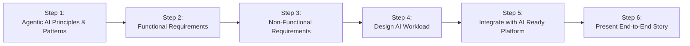

# Agentic AI Challenge Overview

Welcome to the **IFS Agentic AI Challenge**. This challenge guides you through designing, deploying, and operationalizing an internal AI workload using Agentic AI principles, building on the foundation established in the AI Ready Challenge.

---

## Prerequisites

Before starting this challenge, ensure you have:

- **Completed AI Ready Challenge** with selected use cases and prioritized business outcomes
- **Azure Landing Zone foundation** established from Challenge 1
- **Access to internal stakeholders** for use case validation and requirements gathering
- **One selected use case** from the AI Ready Challenge for detailed implementation

---

## Challenge Context

**Internal Use Case Focus:** This workload addresses an internal use case within IFS, serving as a learning journey to build expertise with Azure AI before customer-facing engagements.

**Risk Minimization & Compliance:** Internal deployment provides a low-risk, low-regulatory path to AI innovation while building team confidence and readiness across organizations.

**Productivity Focus:** Generative AI serves as a productivity accelerator, augmenting internal users to work faster and smarter with intelligent automation.

**Agentic AI Principles:** Solutions must incorporate:
- **Automated collections of tasks** that work together seamlessly
- **Operation with or without human supervision** based on context and requirements
- **Agent-to-agent collaboration capabilities** enabling intelligent coordination
- **Chained processes** creating cohesive, intelligent systems that deliver business value

---

## Challenge Objectives

- Select and refine one AI use case from the AI Ready Challenge for internal deployment
- Design an Agentic AI solution that automates collections of tasks and processes
- Enable agent-to-agent collaboration and intelligent process chaining
- Focus on productivity acceleration for internal users and teams
- Integrate seamlessly with the Azure Landing Zone foundation from Challenge 1
- Plan and design Day 2 operations including monitoring, scaling, and governance

---

## Challenge Structure

This challenge is divided into six steps:

1. [Step 1: Agentic AI Principles & Patterns](./ifs-rag-step1-agentic-ai-principles.md) – Learn foundational concepts and Azure multi-agent architecture patterns
2. [Step 2: Functional Requirements](./ifs-rag-step2-fr.md) – Capture intended capabilities and behaviors of the AI workload
3. [Step 3: Non-Functional Requirements](./ifs-rag-step3-nfr.md) – Document scalability, performance, security, and compliance attributes
4. [Step 4: Design AI Workload](./ifs-rag-step4-design.md) – Create workload architecture with Agentic AI patterns
5. [Step 5: Integrate with AI Ready Platform](./ifs-rag-step5-integrate.md) – Deploy into Azure Landing Zone with Day 2 operations
6. [Step 6: Present End-to-End Story](./ifs-rag-step6-present.md) – Share journey from use case to deployment and operations

---

## Challenge Workflow (Visual)

## How to Use This Challenge

- **Start with Step 1:** Begin by understanding Agentic AI principles and patterns
- **Build on Challenge 1:** Leverage the use cases and platform foundation from the AI Ready Challenge
- **Work as a team** to complete each step in order with collaborative design sessions
- **Focus on internal productivity** use cases that minimize risk while maximizing learning
- **Apply Agentic AI patterns** throughout your solution design and implementation
- **Use provided activities, guidance, and success criteria** to structure your work systematically
- **Document your findings and designs** for each step to build organizational knowledge

---

## Success Framework

### Key Success Indicators

✅ **Use Case Alignment:** Selected use case directly supports internal productivity goals  
✅ **Agentic Design:** Solution incorporates automated task collections and agent collaboration  
✅ **Platform Integration:** Seamless deployment into existing Azure Landing Zone foundation  
✅ **Operational Readiness:** Day 2 operations planned including monitoring and governance  
✅ **Team Learning:** Internal expertise built for future customer-facing initiatives  

### Learning Outcomes

By completing this challenge, teams will gain:
- **Hands-on experience** with Agentic AI patterns and implementation
- **Practical knowledge** of Azure AI services integration and deployment
- **Operational expertise** in managing AI workloads at scale
- **Confidence** to engage in customer-facing AI initiatives
- **Proven methodologies** for internal AI adoption and change management

---

## Navigation

- [⬅️ Back to AI Ready Challenge](../01-aiready/)
- [Next: Step 1 – Agentic AI Principles & Patterns ➡️](./ifs-rag-step1-agentic-ai-principles.md)