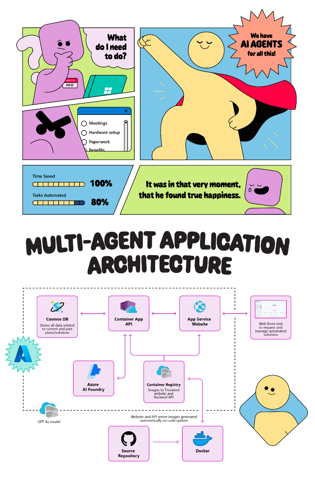

# Step 1: Agentic AI Principles & Patterns

This step provides essential understanding of Agentic AI principles and patterns needed for the IFS Agentic AI Challenge. Complete this foundational learning before proceeding to the functional requirements in Step 2.

---

## What is Agentic AI?

**Agentic AI** represents a paradigm shift from traditional AI systems that simply respond to queries, to intelligent systems that can autonomously plan, execute, and coordinate complex workflows. These systems operate as **digital agents** that can work independently or collaboratively to achieve business objectives.

### Key Characteristics

🤖 **Autonomous Operation:** Agents can operate with minimal human supervision  
🔗 **Task Orchestration:** Coordinate and execute collections of related tasks  
🤝 **Collaborative Intelligence:** Multiple agents work together toward common goals  
📋 **Goal-Oriented:** Focus on achieving specific business outcomes, not just responding to requests  
🔄 **Adaptive Workflow:** Can adjust approaches based on context and feedback  

---

## Core Agentic AI Principles

### 1. **Automated Collections of Tasks**

**Principle:** Instead of handling single requests, Agentic AI systems orchestrate entire workflows of related tasks.

**Example:** A document processing agent doesn't just extract text—it:
- Receives and classifies documents
- Extracts relevant information
- Validates data against business rules
- Routes to appropriate systems
- Notifies stakeholders of completion

**Implementation Pattern:**
```
Input → Agent Analysis → Task Decomposition → Parallel Execution → Results Synthesis → Output
```

### 2. **Operation with or without Human Supervision**

**Principle:** Systems adapt their level of autonomy based on context, risk, and business rules.

**Supervision Levels:**
- **Fully Autonomous:** Handle routine, low-risk tasks independently
- **Human-in-the-Loop:** Present recommendations for human approval
- **Human-on-the-Loop:** Operate autonomously with oversight and intervention capability
- **Human-in-Command:** Execute only with explicit human direction

**Example Decision Matrix:**
| Task Risk | Business Impact | Supervision Level |
|-----------|----------------|-------------------|
| Low | Low | Fully Autonomous |
| Low | High | Human-on-the-Loop |
| High | Low | Human-in-the-Loop |
| High | High | Human-in-Command |

### 3. **Agent-to-Agent Collaboration**

**Principle:** Multiple specialized agents coordinate to solve complex problems that exceed individual agent capabilities.

**Collaboration Patterns:**
- **Sequential:** Agent A completes work, passes to Agent B
- **Parallel:** Multiple agents work simultaneously on different aspects
- **Hierarchical:** Orchestrator agent coordinates specialist agents
- **Peer-to-Peer:** Agents negotiate and collaborate directly

**Example Multi-Agent System:**
```
Research Agent ←→ Analysis Agent ←→ Synthesis Agent
       ↓                ↓                ↓
   Web Search      Data Processing    Report Generation
   Document Review  Pattern Recognition  Stakeholder Notification
```

### 4. **Chained Processes**

**Principle:** Individual tasks link together to create intelligent, end-to-end business processes.

**Process Chain Elements:**
- **Triggers:** Events that initiate the chain
- **Handoffs:** Seamless data transfer between steps
- **Decision Points:** Logic that determines next actions
- **Feedback Loops:** Results that influence future executions
- **Exception Handling:** Graceful management of errors or edge cases

---

## Common Agentic AI Patterns

### Pattern 1: **The Orchestrator Pattern**

**When to Use:** Complex workflows requiring coordination of multiple specialized agents.

**Structure:**
```
Central Orchestrator Agent
├── Data Collection Agent
├── Analysis Agent  
├── Decision Agent
└── Action Agent
```

**Example Use Case:** Customer service resolution system where one agent coordinates research, analysis, decision-making, and response execution.

### Pattern 2: **The Pipeline Pattern**

**When to Use:** Sequential processing where each step builds on the previous.

**Structure:**
```
Input → Agent 1 → Agent 2 → Agent 3 → Output
        (Ingest)  (Process) (Validate) (Deliver)
```

**Example Use Case:** Document processing pipeline from ingestion through analysis to final report generation.

### Pattern 3: **The Swarm Pattern**

**When to Use:** Parallel processing of similar tasks requiring collective intelligence.

**Structure:**
```
Task Distribution
    ↓
[Agent A] [Agent B] [Agent C] [Agent D]
    ↓         ↓         ↓         ↓
Result Aggregation & Synthesis
```

**Example Use Case:** Market research where multiple agents simultaneously analyze different data sources.

### Pattern 4: **The Hierarchical Pattern**

**When to Use:** Complex decision-making requiring multiple levels of expertise.

**Structure:**
```
Strategic Agent (High-level planning)
    ↓
Tactical Agents (Specific domain expertise)
    ↓
Operational Agents (Task execution)
```

**Example Use Case:** IT incident management with strategic, technical, and operational response layers.

---

## Azure Services for Agentic AI

### Microsoft's Multi-Agent Platform: Azure AI Foundry

Microsoft has positioned **Azure AI Foundry** as an "agent factory"—a unified platform for building, deploying, and managing multi-agent systems at scale. With over 60,000 customers and access to 1,800+ models, Azure AI Foundry provides the comprehensive infrastructure needed for enterprise-grade agentic applications.

**Key Capabilities:**
- **Semantic Kernel Agent Framework:** Simplifies multi-agent orchestration and reduces development complexity
- **Azure AI Agent Service:** Production-ready agent hosting and management
- **Advanced Observability:** Built-in evaluations, tracing, and A/B testing for agent performance
- **AI Red Teaming Agent:** Automated safety and security testing for responsible AI deployment

### Core Azure AI Services

| Service | Agentic AI Capability | Use Case |
|---------|----------------------|----------|
| **Azure OpenAI** | Natural language understanding and generation | Agent communication, reasoning |
| **Azure AI Search** | Intelligent information retrieval | Knowledge base for agent decisions |
| **Azure Logic Apps** | Workflow orchestration | Agent coordination and process chaining |
| **Azure Functions** | Event-driven compute | Agent action execution |
| **Azure Service Bus** | Message-based communication | Agent-to-agent messaging |
| **Azure Cognitive Services** | Specialized AI capabilities | Vision, speech, language processing |

### Orchestration & Integration

| Service | Purpose | Agentic AI Role |
|---------|---------|-----------------|
| **Azure AI Foundry** | Complete agent development platform | End-to-end agent factory and management |
| **Semantic Kernel** | Open-source agent framework | Multi-agent orchestration and coordination |
| **Azure AI Studio** | AI development and deployment | Agent development environment |
| **Azure Container Apps** | Scalable agent hosting | Agent runtime environment |
| **Azure API Management** | Agent interface management | Secure agent communication |
| **Azure Monitor** | Observability and insights | Agent performance monitoring |

---

## Real-World Azure Multi-Agent Success Stories

### Fujitsu: Sales Automation Multi-Agent System

**Challenge:** Manual sales proposal creation was time-intensive and error-prone

**Agentic Solution:**
- **Orchestrator Agent:** Coordinates the entire sales proposal workflow
- **Research Agent:** Gathers customer data and market intelligence
- **Analysis Agent:** Evaluates requirements and recommends solutions
- **Content Generation Agent:** Creates tailored proposals and presentations
- **Review Agent:** Validates accuracy and compliance

**Results:** 67% improvement in sales proposal productivity, freeing employees for strategic customer engagement

*"We are using Microsoft's Semantic Kernel and Azure AI Agent Service to orchestrate multiple specialized AI agents and an orchestrator AI to coordinate them to answer questions as a team."* - Hirotaka Ito, Lead Engineer of AI, Fujitsu

### Atomicwork: IT Service Management Agent

**Challenge:** IT and HR teams overwhelmed with repetitive service requests

**Agentic Solution - "Atom" Agent:**
- **Intake Agent:** Classifies and prioritizes service requests
- **Knowledge Agent:** Searches documentation and past solutions
- **Resolution Agent:** Provides automated solutions or escalates appropriately
- **Follow-up Agent:** Ensures issue resolution and gathers feedback

**Results:** Significant productivity gains, reduced operational costs, increased employee satisfaction

### Multi-Agent Architecture Pattern (from Microsoft)



Based on the Microsoft architecture diagram above, here's the recommended multi-agent pattern for Azure deployments:

```
┌─────────────────────────────────────────────────┐
│ Azure AI Foundry Platform                       │
│ ┌─────────────┐  ┌──────────────┐  ┌──────────┐ │
│ │ Azure       │  │ Container    │  │ App      │ │
│ │ Cosmos DB   │◄─┤ App API      │◄─┤ Service  │ │
│ │             │  │              │  │ Website  │ │
│ │ Stores all  │  │              │  │          │ │
│ │ data related│  │              │  │ Web      │ │
│ │ to current  │  │              │  │ front-end│ │
│ │ and past    │  │              │  │ to       │ │
│ │ plans/      │  │              │  │ request  │ │
│ │ solutions   │  │              │  │ and      │ │
│ │             │  │              │  │ manage   │ │
│ │             │  │              │  │ automated│ │
│ │             │  │              │  │ solutions│ │
│ └─────────────┘  └──────┬───────┘  └──────────┘ │
│                         │                       │
│ ┌─────────────┐         │      ┌──────────────┐ │
│ │ Azure AI    │◄────────┘      │ Container    │ │
│ │ Foundry     │                │ Registry     │ │
│ │             │                │              │ │
│ │ GPT 4o model│                │ Images for   │ │
│ │             │                │ Frontend     │ │
│ │             │                │ website and  │ │
│ │             │                │ Backend API  │ │
│ └─────────────┘                └──────────────┘ │
└─────────────────────────────────────────────────┘
                    │
        ┌───────────┴──────────┐
        │                      │
   ┌────▼───┐             ┌────▼────┐
   │ Source │             │ Docker  │
   │ Repo   │────────────►│         │
   │        │             │ Website │
   │        │             │ and API │
   │        │             │ server  │
   │        │             │ images  │
   │        │             │ generated│
   │        │             │ auto on │
   │        │             │ code    │
   │        │             │ update  │
   └────────┘             └─────────┘
```

**Key Components:**
- **Data Layer:** Azure Cosmos DB for agent state and conversation history
- **API Layer:** Container Apps for scalable agent hosting
- **Frontend:** App Service for user interaction and agent management
- **AI Layer:** Azure AI Foundry with GPT-4o for agent intelligence
- **DevOps:** Automated deployment pipeline with Container Registry

---

## Azure Semantic Kernel: The Multi-Agent Framework

Microsoft's **Semantic Kernel** is the open-source foundation that powers Azure's multi-agent capabilities. It dramatically reduces development complexity and provides standardized patterns for agent coordination.

### Key Features

**🔗 Agent Orchestration:** Simplifies coordination between multiple specialized agents  
**📦 Pre-built Components:** Ready-to-use building blocks for common agent patterns  
**🔄 Continuous Improvement:** Built-in feedback loops and observability  
**🛡️ Safety First:** Integrated AI Red Teaming and evaluation frameworks  
**🔧 Developer-Friendly:** Native Visual Studio Code integration and GitHub Copilot support  

### Development Workflow with Azure AI Foundry

```
Development Phase:
├── Visual Studio Code Extension (Public Preview)
├── GitHub Copilot Agent Mode
├── Semantic Kernel Framework
└── Pre-built Agent Templates

Testing & Validation:
├── AI Red Teaming Agent (Public Preview)
├── Agentic Evaluations
├── Risk and Quality Assessments
└── Comprehensive Safety Reports

Deployment & Operations:
├── Azure AI Agent Service
├── Container Apps for Scaling
├── Advanced Observability Suite
└── Real-time Telemetry & Feedback
```

### Enterprise Adoption Patterns

Organizations like **KPMG** and **Accenture** are using Semantic Kernel to:
- Orchestrate workflows among specialized agents
- Dramatically reduce development complexity
- Ensure safe and secure agent deployment
- Scale multi-agent systems across enterprise workloads

*"Azure AI Foundry gives us a one-stop shop for all the right tools and services. To meet the growing demand while ensuring our applications are safe and secure, we're looking into the AI Red Teaming Agent to automatically scan and ensure responsible development."* - Nayan Paul, Managing Director, Accenture

### Azure Multi-Agent Solution Architecture


The solution architecture diagram above demonstrates how Azure AI Foundry orchestrates multiple agents within a comprehensive enterprise platform. Key components include:

**🏗️ Foundation Layer:**
- **Azure Cosmos DB:** Centralized data storage for agent state, conversation history, and knowledge bases
- **Container Registry:** Manages containerized agent deployments and version control
- **Source Repository & Docker:** Enables CI/CD pipeline for agent development and deployment

**🤖 Agent Orchestration Layer:**
- **Container App API:** Scalable hosting environment for multiple specialized agents
- **Azure AI Foundry:** Central intelligence platform providing GPT-4o models and agent coordination
- **App Service Website:** User interface for agent interaction and management

**🔄 Integration Benefits:**
- **Automated Deployment:** Website and API server images generated automatically on code updates
- **Scalable Architecture:** Container-based deployment supports elastic scaling based on demand
- **Centralized Intelligence:** Azure AI Foundry provides consistent AI capabilities across all agents
- **Data Continuity:** Cosmos DB ensures persistent state management and cross-agent data sharing

---

## Single-Agent vs Multi-Agent Architectures

Understanding when to use single-agent versus multi-agent approaches is crucial for successful implementation.

### Single-Agent Systems

**Characteristics:**
- One autonomous entity operating independently
- Simpler to design and implement
- No need for communication protocols
- Suitable for isolated, well-defined tasks

**Example:** A standalone chatbot handling customer FAQs

**When to Use:**
- Simple, linear workflows
- Limited scope of operations
- Minimal integration requirements
- Prototype or proof-of-concept scenarios

### Multi-Agent Systems (MAS)

**Characteristics:**
- Multiple autonomous agents in shared environment
- Sophisticated coordination mechanisms required
- Enhanced scalability and fault tolerance
- Distributed problem-solving capabilities

**Example:** Smart manufacturing with coordinated robots on assembly line

**When to Use:**
- Complex, multi-step business processes
- Need for specialized expertise in different domains
- High scalability requirements
- Fault tolerance and redundancy needs

### Decision Framework: Single vs Multi-Agent

| Factor | Single-Agent | Multi-Agent |
|--------|--------------|-------------|
| **Process Complexity** | Simple, linear | Complex, branching |
| **Domain Expertise** | Single domain | Multiple specializations |
| **Scalability Needs** | Limited scale | High scalability required |
| **Fault Tolerance** | Single point of failure | Distributed resilience |
| **Development Cost** | Lower initial cost | Higher but better ROI at scale |
| **Maintenance** | Simpler updates | Complex but modular |

---

## Design Considerations for Agentic AI

### 1. **Agent Boundaries & Responsibilities**

**Key Questions:**
- What specific capabilities does each agent need?
- How do agents communicate and share context?
- What are the failure modes and recovery strategies?

**Best Practices:**
- Single responsibility principle for each agent
- Clear interfaces and data contracts
- Robust error handling and retry logic

### 2. **Human-AI Collaboration**

**Design Decisions:**
- When should humans be involved in the workflow?
- How do you maintain transparency and explainability?
- What approval mechanisms are needed?

**Implementation Approaches:**
- Confidence thresholds for autonomous action
- Audit trails for all agent decisions
- Easy escalation paths to human experts

### 3. **Security & Governance**

**Critical Considerations:**
- How do you ensure agents operate within business rules?
- What data access controls are needed?
- How do you monitor for misuse or drift?

**Security Patterns:**
- Role-based access control for agents
- Data encryption in transit and at rest
- Regular model validation and testing

### 4. **Scalability & Performance**

**Architectural Decisions:**
- How do agents handle varying workloads?
- What are the bottlenecks in agent communication?
- How do you maintain performance as complexity grows?

**Scaling Strategies:**
- Async communication patterns
- Load balancing across agent instances
- Caching and state management

---

## Getting Started: Design Thinking for Agentic AI

### Step 1: **Identify the Business Process**
- Map the current workflow
- Identify pain points and inefficiencies
- Define success metrics

### Step 2: **Decompose into Agent-Suitable Tasks**
- Break process into logical components
- Identify decision points and data dependencies
- Determine automation potential for each component

### Step 3: **Design Agent Architecture**
- Choose appropriate patterns (orchestrator, pipeline, swarm, hierarchical)
- Define agent responsibilities and interfaces
- Plan communication and coordination mechanisms

### Step 4: **Plan Human Integration**
- Determine supervision levels needed
- Design approval and escalation workflows
- Create transparency and explainability features

### Step 5: **Implement Governance & Monitoring**
- Establish performance metrics and KPIs
- Implement security and compliance controls
- Create operational monitoring and alerting

---

## Real-World Examples

### Example 1: **Customer Support Resolution**

**Traditional Approach:** Human agent handles all aspects of customer inquiry

**Agentic Approach:**
- **Intake Agent:** Classifies and prioritizes incoming requests
- **Research Agent:** Gathers relevant customer history and product information
- **Analysis Agent:** Determines issue root cause and potential solutions
- **Resolution Agent:** Implements solution or escalates to human specialist
- **Follow-up Agent:** Ensures customer satisfaction and closes loop

### Example 2: **Financial Report Generation**

**Traditional Approach:** Analyst manually collects, analyzes, and reports on financial data

**Agentic Approach:**
- **Data Collection Agent:** Gathers data from multiple financial systems
- **Validation Agent:** Ensures data quality and consistency
- **Analysis Agent:** Performs calculations and identifies trends
- **Insight Agent:** Generates narrative explanations of findings
- **Distribution Agent:** Formats and delivers reports to stakeholders

### Example 3: **Software Development Pipeline**

**Traditional Approach:** Developers manually coordinate code review, testing, and deployment

**Agentic Approach:**
- **Code Review Agent:** Analyzes code quality and suggests improvements
- **Testing Agent:** Executes comprehensive test suites and reports results
- **Security Agent:** Scans for vulnerabilities and compliance issues
- **Deployment Agent:** Manages release orchestration and rollback procedures
- **Monitoring Agent:** Tracks application performance and user experience

---

## Success Metrics for Agentic AI

### Operational Metrics
- **Task Completion Rate:** Percentage of tasks completed without human intervention
- **Processing Time:** Average time from input to final output
- **Error Rate:** Frequency of incorrect or failed operations
- **Escalation Rate:** How often human intervention is required

### Business Impact Metrics
- **Productivity Improvement:** Increase in work completed per unit time
- **Cost Reduction:** Decreased operational expenses through automation
- **Quality Enhancement:** Improved accuracy and consistency of outputs
- **Employee Satisfaction:** Reduced mundane work, increased focus on high-value activities

### Technical Performance Metrics
- **Response Time:** Speed of agent responses and inter-agent communication
- **Throughput:** Volume of work processed per unit time
- **Resource Utilization:** Efficiency of compute and storage usage
- **Availability:** System uptime and reliability

---

## Next Steps

Now that you understand Agentic AI principles and patterns, you're ready to:

1. **Proceed to the Agentic AI Challenge** and apply these concepts
2. **Select an appropriate use case** from your AI Ready Challenge work
3. **Choose relevant patterns** that fit your business process
4. **Design your agent architecture** using Azure services
5. **Plan for human collaboration** and operational excellence

---

## Additional Resources

### Microsoft Documentation
- [Azure AI Services Documentation](https://learn.microsoft.com/en-us/azure/ai-services/)
- [Azure OpenAI Service](https://learn.microsoft.com/en-us/azure/ai-services/openai/)
- [Azure Logic Apps](https://learn.microsoft.com/en-us/azure/logic-apps/)
- [Azure AI Search](https://learn.microsoft.com/en-us/azure/search/)

### Industry Research
- [McKinsey: The Age of AI Agents](https://www.mckinsey.com/capabilities/mckinsey-digital/our-insights/the-economic-potential-of-generative-ai-the-next-productivity-frontier)
- [MIT Technology Review: AI Agents](https://www.technologyreview.com/2024/01/02/1086046/whats-next-for-ai-in-2024/)
- [Gartner: Agentic AI Research](https://www.gartner.com/en/information-technology/insights/artificial-intelligence)

### Azure Architecture Patterns
- [Cloud Design Patterns](https://learn.microsoft.com/en-us/azure/architecture/patterns/)
- [Azure Well-Architected Framework](https://learn.microsoft.com/en-us/azure/well-architected/)
- [AI Architecture Guidance](https://learn.microsoft.com/en-us/azure/architecture/ai-ml/)

---

[⬅️ Back to Agentic AI Challenge Overview](./ifs-rag-overview.md) | [Next: Step 2 – Functional Requirements ➡️](./ifs-rag-step2-fr.md)
