# AI Hub Challenge Overview

[Home](../../index.md) > [AI Hub Challenge](../../ai-hub-challenge.md) > [Overview](./ifs-aihub-overview.md)

- [Next: Step 1 - Scenario ➡️](./ifs-aihub-step1-scenario.md)

Welcome to the **IFS AI Hub Challenge**. This challenge guides you through designing a secure, scalable, and governed Azure-based AI Hub to centrally manage and control shared AI services for IFS, building on lessons learned from the RAG chatbot implementation.

---

## Challenge Objectives

- Analyze IFS’s business context and drivers for a centralized AI Hub
- Identify and prioritize business, technical, and compliance requirements
- Design a robust Azure AI Hub architecture aligned with best practices
- Present and justify your solution to peers

[🔝 Back to Top](#ai-hub-challenge-overview)

---

## XLR8 Challenge Journey

> [!NOTE]
> This AI Hub Challenge is the third and final challenge in a series of three connected challenges that build upon each other to create a comprehensive AI solution for IFS.

### How the Three Challenges Connect

```mermaid
flowchart TB
    Ready["1️⃣ AI Ready Challenge
    Secure, governed Azure foundation"]
    Agent["2️⃣ AI Agent Challenge
    Internal RAG chatbot application"]
    Hub["3️⃣ AI Hub Challenge
    Centralized AI service management"]
    
    Ready --> Agent
    Agent --> Hub
    
    classDef ready fill:#0078D4,color:white,stroke:#0078D4,stroke-width:2px
    classDef agent fill:#107C10,color:white,stroke:#107C10,stroke-width:2px
    classDef hub fill:#8661C5,color:white,stroke:#8661C5,stroke-width:2px
    
    class Ready ready
    class Agent agent
    class Hub hub
```



### Your Role in the Journey

In this **AI Hub Challenge**, you'll build upon both previous challenges:

1. **Scaled Enterprise Solution**: You'll design a centralized platform that can serve multiple applications like the one created in Challenge 2
2. **Governance at Scale**: You'll extend the governance principles from Challenge 1 to manage AI services centrally
3. **Lessons Applied**: You'll incorporate learnings from the RAG chatbot deployment to inform your enterprise-wide AI Hub architecture
    
    class Ready ready
    class Agent agent
    class Hub hub
```

**Progressive AI Journey:**
1. [**AI Ready Challenge ←**](../../ai-ready-challenge.md) - Established the secure Azure foundation
2. [**AI Agent Challenge ←**](../../ai-agent-challenge.md) - Built an internal RAG chatbot and demonstrated the need for a centralized AI management approach
3. **AI Hub Challenge (Current)** - Creates a centralized AI management platform that builds on lessons learned from the first two challenges

This challenge applies the experience gained from implementing a specific AI workload (in the AI Agent Challenge) to create a scalable, central platform for managing all AI services across the organization.

> For consistent terminology across all challenges, refer to the [**Shared Glossary →**](../../shared-glossary.md)

---

## Challenge Structure

This challenge is divided into four steps:

1. [Step 1: Scenario](./ifs-aihub-step1-scenario.md) – Analyze the business scenario and user needs
2. [Step 2: Requirements](./ifs-aihub-step2-requirements.md) – Identify and document requirements
3. [Step 3: Design](./ifs-aihub-step3-design.md) – Design the AI Hub architecture
4. [Step 4: Present](./ifs-aihub-step4-present.md) – Present and justify your solution

[🔝 Back to Top](#ai-hub-challenge-overview)

## Challenge Workflow (Visual)

```mermaid
flowchart LR
    %% Define the flow of the AI Hub Challenge
    Start([Start]) --> Step1
    Step1[Step 1:<br>Scenario] --> Step2[Step 2:<br>Requirements]
    Step2 --> Step3[Step 3:<br>Design]
    Step3 --> Step4[Step 4:<br>Present & Justify]
    Step4 --> End([End])
    
    %% Add descriptions
    classDef step fill:#0072C6,stroke:#025,color:white,stroke-width:2px
    classDef endpoint fill:#5CB85C,stroke:#4CAE4C,color:white,stroke-width:2px
    
[🔝 Back to Top](#ai-hub-challenge-overview)
    
    class Step1,Step2,Step3,Step4 step
    class Start,End endpoint
    
    %% Add annotations
    Step1 -.-> Ann1[Business scenario<br>and use case<br>analysis]
    Step2 -.-> Ann2[Business, technical<br>and compliance<br>requirements]
    Step3 -.-> Ann3[Centralized AI Hub<br>architecture design]
    Step4 -.-> Ann4[Solution presentation<br>and justification]
```

---

## How to Use This Challenge

- Work as a team to complete each step in order
- Use the provided activities, guidance, and success criteria to structure your work
- Reference the [Azure Best Practices](../05-azure-best-practices/) for proven recommendations
- Document your findings and designs for each step

---

## Navigation
- [Next: Step 1 - Scenario ➡️](./ifs-aihub-step1-scenario.md)
- [🏠 AI Hub Challenge Home](../../ai-hub-challenge.md)