# Step 1: Scenario

**📊 Progress:** Step 1 of 4
**⏱️ Estimated Time:** 2 hours

## Executive Summary
This initial step establishes the business context and drivers for creating a centralized AI Hub at IFS. By analyzing the organizational challenges and needs, you'll develop a clear understanding of how a well-designed AI Hub can accelerate innovation while maintaining governance and security.

[Home](../../index.md) > [AI Hub Challenge](../../ai-hub-challenge.md) > [Step 1 - Scenario](./ifs-aihub-step1-scenario.md)

- [Next: Step 2 - Requirements ➡️](./ifs-aihub-step2-requirements.md)

This section is part of the **IFS AI Hub Challenge**. Here, you'll analyze the business scenario and user needs for a centralized, secure AI Hub.

## Table of Contents
{:.no_toc}

* TOC
{:toc}

*Note: Generated using Jekyll's automatic table of contents feature*

---

```mermaid
flowchart LR
    A[🚀 Start] --> B[📝 Step 1 Scenario]
    B -->|Current| C[📋 Step 2 Requirements]
    C --> D[🏗️ Step 3 Design]
    D --> E[📊 Step 4 Presentation]
    style B fill:#90EE90,stroke:#333,stroke-width:2px
```

## 🎯 Objective

Understand the business context, drivers, and high-level goals for the AI Hub solution.

[🔝 Back to Top](#step-1-scenario)

---

## 📝 Activities

- Review the scenario below.
- As a team, discuss and answer:
  1. **📊 What are the main business drivers and user needs for a centralized AI Hub?**
  2. **What are the high-level architectural elements, security considerations, and governance mechanisms needed?**
  3. **What lessons from the RAG chatbot implementation should inform the AI Hub design?**

[🔝 Back to Top](#step-1-scenario)

---

## Scenario
After successfully implementing the RAG chatbot for internal knowledge management, Innovate Financial Services (IFS) has recognized the broader potential of AI services across the organization. However, the implementation also highlighted several challenges:

- The current approach of deploying AI services directly into application landing zones would become difficult to manage and govern as more departments request AI capabilities
- Security, compliance, and cost controls need to be centralized and standardized
- Multiple teams are now requesting access to AI services, but with varying requirements
- The expertise gained from the RAG chatbot implementation should be leveraged to create a more scalable solution

To address these emerging needs, IFS has decided to build a dedicated "AI Hub" that will host shared Azure AI services (including Azure OpenAI, Azure AI Search, and potentially other AI-related services). This hub will serve as the centralized point for deploying, managing, and accessing AI services across the organization, building upon the lessons learned from the initial RAG chatbot implementation.

[🔝 Back to Top](#step-1-scenario)

---

## Guidance

> **Tip:** Focus on extracting the key business drivers, user needs, and constraints that will inform your design decisions. Reference the [Azure OpenAI baseline Landing Zone reference architecture](https://learn.microsoft.com/azure/architecture/ai-ml/architecture/azure-openai-baseline-landing-zone) and [Azure Best Practices](../05-azure-best-practices/).

[🔝 Back to Top](#step-1-scenario)

---

## Success Criteria ✅

By the end of this step, you should have:
- ✓ Identified the primary business drivers and user needs for the AI Hub
- ✓ Listed the core architectural and governance elements required
- ✓ Acknowledged key lessons learned from the RAG chatbot implementation

To successfully complete this step, ensure you have a clear understanding of why IFS needs a centralized AI Hub and what primary challenges it must address.

[🔝 Back to Top](#step-1-scenario)

---

## Navigation
- [⬅️ Previous: Overview](./ifs-aihub-overview.md)
- [Next: Step 2 - Requirements ➡️](./ifs-aihub-step2-requirements.md)
- [🏠 AI Hub Challenge Home](../../ai-hub-challenge.md)
