<!-- filepath: c:\Repos\xlr8-e2eaisolutions\docs\03-aihub\ifs-aihub-step2-requirements.md -->
---
layout: default
title: Step 2 - Requirements
parent: AI Hub Challenge
nav_order: 2
---

# Step 2: Requirements

**📊 Progress:** Step 2 of 4

[Home](../../index.md) > [AI Hub Challenge](../../ai-hub-challenge.md) > [Step 2 - Requirements](./ifs-aihub-step2-requirements.md)

- [⬅️ Previous: Step 1 - Scenario](./ifs-aihub-step1-scenario.md)
- [Next: Step 3 - Design ➡️](./ifs-aihub-step3-design.md)

This section is part of the **IFS AI Hub Challenge**. Here, you'll identify and document the business, technical, and governance requirements for a centralized AI Hub.

---

```mermaid
flowchart LR
    A[🚀 Start] --> B[📝 Step 1:\nScenario]
    B --> C[📋 Step 2:\nRequirements]
    C -->|Current| D[🏗️ Step 3:\nDesign]
    D --> E[📊 Step 4:\nPresentation]
    style C fill:#90EE90,stroke:#333,stroke-width:2px
```

## 🎯 Objective

Capture all critical requirements—network, access, secrets, monitoring, governance, and scalability—that must be addressed in your solution.

[🔝 Back to Top](#step-2-requirements)

---

## 📝 Activities

- Review your findings from Step 1 (Scenario).
- As a team, discuss and document:
  1. **Network Isolation:** What are the requirements for private endpoints, VNet integration, and secure cross-VNet connectivity?
  2. **Access Control:** What are the requirements for secure gateways, authentication, authorization, and traffic management?
  3. **Secrets Management:** What are the requirements for centralized secret storage, secure access, rotation, and auditing?
  4. **Monitoring & Logging:** What are the requirements for logging, monitoring, usage tracking, and security event alerting?
  5. **Governance:** What are the requirements for policy enforcement, resource management, compliance, and cost control?
  6. **Scalability:** What are the requirements for supporting multiple workloads and onboarding new services?

[🔝 Back to Top](#step-2-requirements)

---

## Guidance

> **Best Practice:** Reference the [Azure Best Practices](../05-azure-best-practices/) and [Azure OpenAI baseline Landing Zone reference architecture](https://learn.microsoft.com/azure/architecture/ai-ml/architecture/azure-openai-baseline-landing-zone) for security, governance, and operational recommendations.
>
> - Use bullet points or tables for clarity.
> - Prioritize requirements as "Must Have" or "Nice to Have".
> - Consider both current and future needs.

[🔝 Back to Top](#step-2-requirements)

---

## Success Criteria

By the end of this step, you should have:
- Documented requirements for each major area (network, access, secrets, monitoring, governance, scalability)
- Prioritized requirements and aligned them with business needs
- Ensured requirements reflect lessons learned from the RAG chatbot implementation

[🔝 Back to Top](#step-2-requirements)

---

## Navigation
- [⬅️ Previous: Step 1 - Scenario](./ifs-aihub-step1-scenario.md)
- [Next: Step 3 - Design ➡️](./ifs-aihub-step3-design.md)
- [🏠 AI Hub Challenge Home](../../ai-hub-challenge.md)
