# Step 3: Design

**📊 Progress:** Step 3 of 4
**⏱️ Estimated Time:** 5-6 hours

## Executive Summary
This step represents the core architecture work for the AI Hub solution. You'll create a comprehensive technical design that addresses IFS's requirements while following Azure best practices for secure, scalable AI platforms. Your design will establish a central foundation for accelerating AI innovation across the organization.

[Home](../../index.md) > [AI Hub Challenge](../../ai-hub-challenge.md) > [Step 3 - Design](./ifs-aihub-step3-design.md)

- [⬅️ Previous: Step 2 - Requirements](./ifs-aihub-step2-requirements.md) *(prerequisite)*
- [Next: Step 4 - Present ➡️](./ifs-aihub-step4-present.md)

This section is part of the **IFS AI Hub Challenge**. Here, you'll design the end-to-end architecture for the AI Hub, ensuring alignment with Azure best practices and reference architectures.

## Table of Contents
{:.no_toc}

* TOC
{:toc}

*Note: Generated using Jekyll's automatic table of contents feature*

---

```mermaid
flowchart LR
    A[🚀 Start] --> B[📝 Step 1 Scenario]
    B --> C[📋 Step 2 Requirements]
    C --> D[🏗️ Step 3 Design]
    D -->|Current| E[📊 Step 4 Presentation]
    style D fill:#90EE90,stroke:#333,stroke-width:2px
```

## 🎯 Objective

> [!NOTE]
> This step is critical for the success of the AI Hub Challenge. A well-designed architecture ensures that the AI Hub can scale securely to support the organization's AI initiatives.

Define the architecture, controls, and Azure services needed for a robust, secure, and scalable AI Hub solution.

[🔝 Back to Top](#step-3-design)

---

## 📝 Activities

- Review your findings from Steps 1 and 2.
- As a team, design and document:
  1. **Architecture:** Draw a high-level architecture diagram showing the AI Hub architecture.
  2. **Service Selection:** List Azure services that will be part of the AI Hub.  3. **Network Security:** Detail the network design including VNets, subnets, NSGs, and private endpoints.
  
  ⚠️ **Important:** Ensure your network design includes private endpoints for all Azure AI services to maintain data security and comply with data residency requirements. This is particularly critical for AI services that process sensitive information.
  
  4. **Identity & Access:** Define the identity model, service principals, managed identities, and RBAC.
  5. **Cost Controls:** Design the approach for cost tagging, budgets, and alerts.
  6. **Monitoring & Operations:** Design the monitoring strategy, logs, and alerts.
  7. **Resource Management:** Define the resource group structure, tagging strategy, and governance controls.

[🔝 Back to Top](#step-3-design)

---

## Guidance

💡 **TIP** Start with a high-level architecture diagram that shows the main components of your AI Hub, then drill down into specific areas such as networking, security, and service deployment.

> **Best Practice:** Reference the [Azure OpenAI baseline Landing Zone reference architecture](https://learn.microsoft.com/azure/architecture/ai-ml/architecture/azure-openai-baseline-landing-zone) and apply these principles to your broader AI Hub design.
>
> - Incorporate architectural patterns from [Azure Architecture Center](https://docs.microsoft.com/en-us/azure/architecture/).
> - Apply the [Well-Architected Framework](https://docs.microsoft.com/en-us/azure/architecture/framework/) pillars.
> - Consider use of Infrastructure as Code (Bicep/ARM/Terraform) for deployment.

### Sample AI Hub Architecture Diagram

[🔝 Back to Top](#step-3-design)

---

## Success Criteria ✅

By the end of this step, you should have:
- ✓ A comprehensive AI Hub architecture diagram
- ✓ Clear rationale for Azure service selections
- ✓ Documentation of network, identity, cost, and operational controls
- ✓ A governance model that meets IFS requirements

To successfully complete this step, your design should provide a complete technical blueprint for implementing the AI Hub that addresses all requirements identified in the previous step.

[🔝 Back to Top](#step-3-design)

---

## Navigation

⚠️ **WARNING** Before moving to Step 4, ensure your architecture design addresses all the requirements identified in Step 2, including security, governance, and operational considerations.

- [⬅️ Previous: Step 2 - Requirements](./ifs-aihub-step2-requirements.md)
- [Next: Step 4 - Present ➡️](./ifs-aihub-step4-present.md)
- [🏠 AI Hub Challenge Home](../../ai-hub-challenge.md)
