<!-- filepath: c:\Repos\xlr8-e2eaisolutions\docs\03-aihub\ifs-aihub-step3-design.md -->
---
layout: default
title: Step 3 - Design
parent: AI Hub Challenge
nav_order: 3
---

# Step 3: Design

**📊 Progress:** Step 3 of 4

[Home](../../index.md) > [AI Hub Challenge](../../ai-hub-challenge.md) > [Step 3 - Design](./ifs-aihub-step3-design.md)

- [⬅️ Previous: Step 2 - Requirements](./ifs-aihub-step2-requirements.md)
- [Next: Step 4 - Present ➡️](./ifs-aihub-step4-present.md)

This section is part of the **IFS AI Hub Challenge**. Here, you'll design the end-to-end architecture for the AI Hub, ensuring alignment with Azure best practices and reference architectures.

---

```mermaid
flowchart LR
    A[🚀 Start] --> B[📝 Step 1:\nScenario]
    B --> C[📋 Step 2:\nRequirements]
    C --> D[🏗️ Step 3:\nDesign]
    D -->|Current| E[📊 Step 4:\nPresentation]
    style D fill:#90EE90,stroke:#333,stroke-width:2px
```

## 🎯 Objective

Define the architecture, controls, and Azure services needed for a robust, secure, and scalable AI Hub solution.

[🔝 Back to Top](#step-3-design)

---

## 📝 Activities

- Review your findings from Steps 1 and 2.
- As a team, design and document:
  1. **Architecture:** Draw a high-level architecture diagram showing the AI Hub architecture.
  2. **Service Selection:** List Azure services that will be part of the AI Hub.
  3. **Network Security:** Detail the network design including VNets, subnets, NSGs, and private endpoints.
  4. **Identity & Access:** Define the identity model, service principals, managed identities, and RBAC.
  5. **Cost Controls:** Design the approach for cost tagging, budgets, and alerts.
  6. **Monitoring & Operations:** Design the monitoring strategy, logs, and alerts.
  7. **Resource Management:** Define the resource group structure, tagging strategy, and governance controls.

[🔝 Back to Top](#step-3-design)

---

## Guidance

> **Best Practice:** Reference the [Azure OpenAI baseline Landing Zone reference architecture](https://learn.microsoft.com/azure/architecture/ai-ml/architecture/azure-openai-baseline-landing-zone) and apply these principles to your broader AI Hub design.
>
> - Incorporate architectural patterns from [Azure Architecture Center](https://docs.microsoft.com/en-us/azure/architecture/).
> - Apply the [Well-Architected Framework](https://docs.microsoft.com/en-us/azure/architecture/framework/) pillars.
> - Consider use of Infrastructure as Code (Bicep/ARM/Terraform) for deployment.

[🔝 Back to Top](#step-3-design)

---

## Success Criteria

By the end of this step, you should have:
- A comprehensive AI Hub architecture diagram
- Clear rationale for Azure service selections
- Documentation of network, identity, cost, and operational controls
- A governance model that meets IFS requirements

[🔝 Back to Top](#step-3-design)

---

## Navigation
- [⬅️ Previous: Step 2 - Requirements](./ifs-aihub-step2-requirements.md)
- [Next: Step 4 - Present ➡️](./ifs-aihub-step4-present.md)
- [🏠 AI Hub Challenge Home](../../ai-hub-challenge.md)
