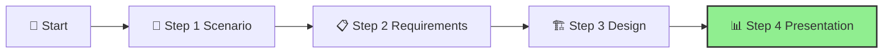

# Step 4: Present & Justify

**📊 Progress:** Step 4 of 4
**⏱️ Estimated Time:** 3-4 hours (preparation) + 30 minutes (presentation)

## Executive Summary
This final step showcases your AI Hub solution to key stakeholders at IFS. By developing a compelling presentation that highlights business value, architectural decisions, and implementation approach, you'll build confidence in your design and demonstrate how it will enable secure, governed AI innovation across the organization.

[Home](../../index.md) > [AI Hub Challenge](../../ai-hub-challenge.md) > [Step 4 - Present & Justify](./ifs-aihub-step4-present.md)

- [⬅️ Previous: Step 3 - Design](./ifs-aihub-step3-design.md) *(prerequisite)*

This section is part of the **IFS AI Hub Challenge**. Here, you'll present your AI Hub solution and justify your design decisions to the group.

---

## 🎯 Objective

Communicate your design clearly, explain your choices, and demonstrate how your solution meets IFS's business and technical requirements while showcasing ROI and strategic alignment.

[🔝 Back to Top](#step-4-present--justify)

---

## 📝 Mandatory Presentation Activities

Your presentation must cover:

1. **📊 Solution Summary** – Brief overview of the AI Hub solution
2. **Architecture Diagram** – Visual representation of your design
3. **Service Selection Rationale** – Why you chose specific Azure services
4. **Key Benefits & Value** – How the solution delivers business value
5. **Governance Controls** – How security, compliance, and cost are managed
6. **Implementation Approach** – High-level execution plan and timelines
7. **Open Q&A** – Time for questions and feedback

[🔝 Back to Top](#step-4-present--justify)

---

## Guidance

> **Effective Communication Tips:**
>
> - Keep your presentation concise (10-15 minutes).
> - Use visuals to illustrate complex concepts.
> - Connect technical decisions to business requirements.
> - Be prepared to defend your design choices.
> - Highlight differentiation from standard reference architectures.
> - Emphasize ROI and business alignment.

[🔝 Back to Top](#step-4-present--justify)

---

## Evaluation Criteria

Your solution will be evaluated on:

- **Technical Excellence** – Sound architecture and Azure service selection
- **Security & Governance** – Robust security and compliance controls
- **Business Alignment** – Clear connection to IFS business needs
- **Innovation** – Creative but pragmatic approaches
- **Communication** – Clear, confident presentation

[🔝 Back to Top](#step-4-present--justify)

---

## Resources

- [Effective Technical Presentations](https://aka.ms/EffectiveTechPresentations)
- [Azure Architecture Diagrams](https://learn.microsoft.com/en-us/azure/architecture/browse/)

## Success Criteria ✅

By the end of this step, you should have:
- ✓ Delivered a clear, compelling presentation of your AI Hub solution
- ✓ Demonstrated how your design meets business and technical requirements
- ✓ Explained your architectural decisions and their alignment with best practices
- ✓ Received and responded to feedback from peers

To successfully complete this step, your presentation should effectively communicate the business value and technical excellence of your AI Hub solution in a way that builds stakeholder confidence and support.

[🔝 Back to Top](#step-4-present--justify)

---

## Navigation
- [⬅️ Previous: Step 3 - Design](./ifs-aihub-step3-design.md)
- [🏠 AI Hub Challenge Home](../../ai-hub-challenge.md)
