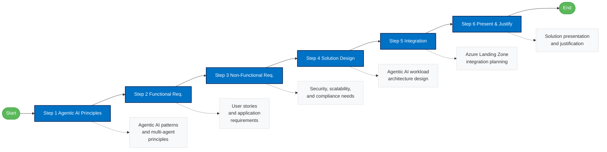

# AI Agent Challenge

The AI Agent Challenge guides you through designing a secure internal Retrieval-Augmented Generation (RAG) chatbot application for IFS employees.

This section focuses on creating a chatbot architecture that integrates with the existing Azure Landing Zones while meeting specific security and performance requirements.

## Challenge Steps

1. [Agentic AI Principles & Patterns](./02-agent/ifs-agent-step1-principles.md)
2. [Functional Requirements](./02-agent/ifs-agent-step2-functional-requirements.md)
3. [Non-Functional Requirements](./02-agent/ifs-agent-step3-nonfunctional-requirements.md)
4. [Solution Design](./02-agent/ifs-agent-step4-solution-design.md)
5. [Integration](./02-agent/ifs-agent-step5-integration.md)
6. [Present](./02-agent/ifs-agent-step6-presentation.md)

## Additional Resources

- [Challenge Overview](./02-agent/ifs-agent-overview.md)
- [References](./references/ai-agent-references.md)

### Challenge Workflow

## Navigation
- [⬅️ Back to Home](./index.md)
- [Customer Story](./ifs-customer-story.md)
- [AI Ready Challenge](./ai-ready-challenge.md)
- [AI Agent Challenge](./ai-agent-challenge.md)
- [AI Hub Challenge](./ai-hub-challenge.md)
