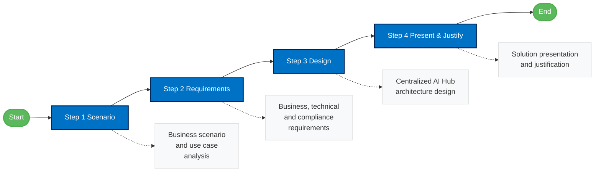

# AI Hub Challenge

The AI Hub Challenge guides you through designing a dedicated, secure "AI Hub" environment to centrally manage and control access to shared Azure AI services.

This section focuses on creating a scalable architecture for enterprise-wide AI governance and management.

## Challenge Steps

1. [Scenario](./03-aihub/ifs-aihub-step1-scenario.md)
2. [Requirements](./03-aihub/ifs-aihub-step2-requirements.md)
3. [Design](./03-aihub/ifs-aihub-step3-design.md)
4. [Present](./03-aihub/ifs-aihub-step4-present.md)

## Additional Resources

- [Overview](./03-aihub/ifs-aihub-overview.md)
- [References](./references/ai-hub-references.md)

### Challenge Workflow

