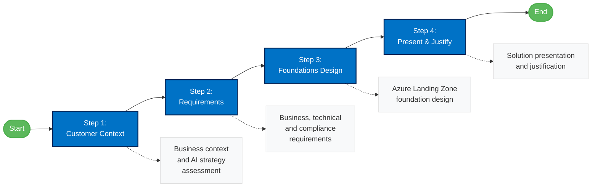

# AI Ready Challenge

The AI Ready Challenge guides you through designing a secure, scalable, and governed Azure foundation to support IFS's AI transformation journey.

This section walks you through the process of designing Azure Landing Zones aligned with IFS's business requirements and security standards.

## Challenge Steps

1. [Customer Context](./01-aiready/ifs-ready-step1-customer.md)
2. [Requirements](./01-aiready/ifs-ready-step2-requirements.md)
3. [Foundations Design](./01-aiready/ifs-ready-step3-foundations.md)
4. [Present](./01-aiready/ifs-ready-step4-present.md)

## Additional Resources

- [Overview](./01-aiready/ifs-ready-overview.md)
- [References](./ifs-alz-references.md)

### Challenge Workflow

## Navigation
- [⬅️ Back to Home](./index.md)
- [Customer Story](./ifs-customer-story.md)
- [AI Ready Challenge](./ai-ready-challenge.md)
- [AI Agent Challenge](./ai-agent-challenge.md)
- [AI Hub Challenge](./ai-hub-challenge.md)
