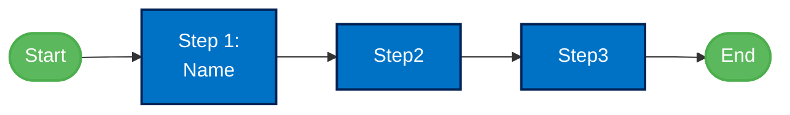

# Documentation Standards

This document outlines the standardized naming conventions and documentation structure for the IFS AI Challenges.

## File Naming Conventions

All challenge files follow a consistent naming pattern:

### Challenge Main Files
- Main challenge pages: `ai-ready-challenge.md`, `ai-agent-challenge.md`, `ai-hub-challenge.md`
- Each in repository root for easy navigation

### Challenge-Specific Files

Files are organized by challenge in numbered directories:
- Challenge 1: `01-aiready/`
- Challenge 2: `02-agent/`
- Challenge 3: `03-aihub/`

### Standard File Naming Pattern

Files within each challenge directory follow this pattern:
```
ifs-{challenge}-{content-type}.md
```

Where:
- `{challenge}` is one of: `ready`, `agent`, or `aihub`
- `{content-type}` is one of:
  - `overview` - Challenge overview
  - `references` - Reference materials
  - `step{n}-{descriptor}` - Challenge step with number and descriptor

Examples:
- `ifs-ready-overview.md`
- `ifs-agent-step1-principles.md`
- `ifs-aihub-references.md`

## Content Structure Standards

### Main Challenge Pages

Each main challenge page (`ai-ready-challenge.md`, etc.) should include:

1. **Title and description**
2. **Challenge Steps** with links to individual steps
3. **Additional Resources** with links to overview and references
4. **Challenge Workflow** diagram using Mermaid
5. **Navigation** links to other challenges

### Step Pages

Each step page should include:

1. **Title** with step number and name
2. **Objectives** section outlining goals
3. **Activities** section with tasks
4. **Guidance/Content** section with relevant information
5. **Navigation** links to previous/next steps

### Overview Pages

Each challenge overview page should include:

1. **Introduction** with context
2. **Prerequisites** if applicable
3. **Challenge Objectives**
4. **Challenge Structure** listing steps
5. **Challenge Workflow** diagram using Mermaid
6. **Success Framework** with indicators and outcomes
7. **Navigation** links

## Mermaid Diagram Standards

Each challenge should include consistent workflow diagrams using Mermaid:



## Navigation Standards

Each page should include three types of navigation elements:

1. **Breadcrumb Navigation** at the top of the page
2. **Previous/Next Navigation** at the top of the page
3. **"Back to Top" Links** after each major section
4. **Bottom Navigation** at the bottom of the page with Previous, Next, and Home links

### Breadcrumb Navigation
```markdown
[Home](../../index.md) > [Challenge Name](../../challenge-name.md) > [Current Page](./current-page.md)
```

### Top Previous/Next Navigation
```markdown
- [⬅️ Previous: Previous Page](./previous-page.md)
- [Next: Next Page ➡️](./next-page.md)
```

### Back to Top Links
After each major section:
```markdown
[🔝 Back to Top](#section-heading-id)
```

### Bottom Navigation for Step Pages
```markdown
## Navigation
- [⬅️ Previous: Previous Step](./previous-step-file.md)
- [Next: Next Step ➡️](./next-step-file.md)
- [🏠 Challenge Home](../../challenge-home.md)
```

### Main Challenge Pages Bottom Navigation
```markdown
## Navigation
- [⬅️ Back to Home](./index.md)
- [Customer Story](./ifs-customer-story.md)
- [AI Ready Challenge](./ai-ready-challenge.md)
- [AI Agent Challenge](./ai-agent-challenge.md)
- [AI Hub Challenge](./ai-hub-challenge.md)
```

## Frontmatter Standards

Each page should include proper frontmatter:

```yaml
---
layout: default
title: Page Title
parent: Parent Section Title
nav_order: X
---
```

Where:
- `title` - Clear, descriptive title of the page
- `parent` - The parent section (e.g., AI Ready Challenge)
- `nav_order` - The order of the page in navigation (0 for overview, 1-N for steps)

## Example File Set

A complete challenge should have this file structure:

```
ai-{challenge}-challenge.md
{nn}-{challenge}/
  ├── ifs-{challenge}-overview.md
  ├── ifs-{challenge}-references.md
  ├── ifs-{challenge}-step1-{descriptor}.md
  ├── ifs-{challenge}-step2-{descriptor}.md
  ├── ifs-{challenge}-step3-{descriptor}.md
  └── ifs-{challenge}-step4-{descriptor}.md
```
