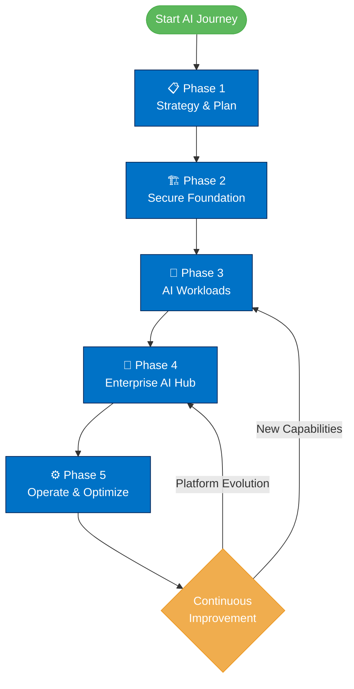

# 🏦 Customer Story: Innovate Financial Services (IFS) AI Transformation Journey

**⏱️ Estimated Reading Time:** 10 minutes

## Executive Summary
Innovate Financial Services (IFS) is embarking on a transformational journey to become an AI-driven financial institution. Facing competitive pressure from fintech disruptors and rising customer expectations, IFS has committed to a comprehensive AI transformation strategy built on Azure. This customer story chronicles their journey from fragmented legacy systems to a unified, governed AI platform that will revolutionize how they serve customers, manage risk, and drive innovation.

[Home](../index.md) > [Customer Story](./ifs-customer-story.md)

## Table of Contents
{:.no_toc}

* TOC
{:toc}

*Note: Generated using Jekyll's automatic table of contents feature*

[🔝 Back to Top](#-customer-story-innovate-financial-services-ifs-ai-transformation-journey)

---

## 📘 Company Background  
**Innovate Financial Services (IFS)** is a leading financial services institution offering banking, investment, and insurance solutions across a broad customer base. With decades of operational history, IFS has earned a strong reputation for reliability, regulatory compliance, and customer trust.

### The Changing Landscape

However, the financial services industry is experiencing unprecedented disruption. The rapid pace of innovation in financial technology (fintech), coupled with shifting customer expectations for digital-first, hyper-personalized experiences, is fundamentally reshaping the industry landscape.

**Key Market Pressures:**

- 🚀 **Fintech Disruption** - Agile competitors delivering AI-powered services in weeks, not months
- 👥 **Customer Expectations** - Demand for instant, personalized experiences across all channels
- 📊 **Data Explosion** - Growing volume of customer data requiring intelligent analysis
- 🔒 **Regulatory Complexity** - Increasing compliance requirements across multiple jurisdictions
- 💰 **Cost Pressures** - Need to reduce operational costs while improving service quality

IFS recognizes that maintaining the status quo is not an option. To remain competitive and relevant, they must fundamentally transform how they operate, innovate, and serve customers.

[🔝 Back to Top](#-customer-story-innovate-financial-services-ifs-ai-transformation-journey)

---

## 🚀 Strategic Imperative: Becoming an AI-Driven Organization  

### The Decision Point

After months of strategic planning sessions, IFS leadership made a pivotal decision: transform into an AI-driven organization with **Azure as the strategic cloud platform**. This wasn't just about adopting new technology—it was about reimagining the entire business model.

### The Vision

IFS leadership has committed to a bold digital transformation strategy — with **AI at the core**. Their ambitious goals include:

- **🔄 Modernizing Operations** - Transform legacy processes with intelligent automation
- **✨ Delivering Exceptional Experiences** - Create hyper-personalized customer journeys powered by AI
- **🛡️ Enhancing Risk Management** - Leverage AI for proactive fraud detection and compliance
- **⚡ Accelerating Innovation** - Reduce time-to-market for new AI-powered services from months to weeks
- **💡 Empowering Employees** - Augment human expertise with AI assistants and intelligent tools

### Why Azure?

**Azure** has been selected as the strategic cloud platform for several critical reasons:

- **Enterprise Security** - Bank-grade security and compliance certifications
- **AI Innovation** - Industry-leading AI services including Azure OpenAI Service
- **Scalability** - Global infrastructure capable of supporting millions of customers
- **Governance** - Comprehensive tools for policy enforcement and regulatory compliance
- **Integration** - Seamless connection to existing Microsoft investments

### The Challenge

IFS is **starting from scratch** on its AI journey. Data is fragmented across legacy systems, infrastructure is inconsistent, and no formal AI strategy exists. To succeed, IFS must build a secure, governed, and future-ready platform that enables responsible innovation at scale—all while maintaining operations and regulatory compliance.

[🔝 Back to Top](#-customer-story-innovate-financial-services-ifs-ai-transformation-journey)

---

## ⚠️ Current State & Challenges

### The Reality Check

Before embarking on their AI transformation, IFS conducted a comprehensive assessment of their current state. What they discovered was sobering—but not uncommon for a traditional financial institution with decades of legacy systems and processes.

### Key Challenges Identified

| **Category** | **Current State** | **Business Impact** |
|-------------|-------------------|---------------------|
| **🏗️ Infrastructure Sprawl** | Hybrid environment with aging on-premises systems and ad-hoc cloud usage; no standard landing zone model | Inconsistent security posture, high operational costs, slow deployment cycles |
| **📊 Siloed Data Landscape** | Data fragmented across legacy systems, departments, and geographical regions with no unified view | Inability to build comprehensive AI models, delayed insights, poor data quality |
| **🔒 Inconsistent Security & Compliance** | Regulatory obligations (PCI DSS, GDPR, local data residency) are hard to enforce consistently | Compliance audit failures, security vulnerabilities, regulatory fines risk |
| **⏱️ Manual, Slow Innovation Cycle** | No standardized dev/test environments or automation; model deployment takes months | Lost market opportunities, frustrated data science teams, competitive disadvantage |
| **💼 Business Pressure to Compete** | Fintech competitors rapidly innovating with AI-powered services | Customer attrition, market share loss, brand reputation erosion |
| **⚖️ Governance Gaps in Early AI Experiments** | Uncoordinated AI pilots across departments without oversight or standards | Data misuse risks, security incidents, wasted resources, conflicting solutions |

### The Pain Points

**From the CIO's Perspective:**
> "We have brilliant people and innovative ideas, but our technology infrastructure is holding us back. Every AI pilot requires months of custom integration work, and we can't guarantee consistent security or compliance. We need a platform that enables innovation while maintaining control."

**From the Chief Data Officer's Perspective:**
> "Our data is our most valuable asset, but it's locked away in silos. Customer data exists in the CRM, transaction data in the core banking system, and analytics in yet another platform. Until we can unify this data in a governed way, our AI ambitions will remain just that—ambitions."

**From the Chief Risk Officer's Perspective:**
> "We're under tremendous pressure to innovate, but we can't compromise on security or compliance. Every new AI experiment introduces potential risks that we struggle to assess and mitigate. We need a framework that builds security and governance in from day one."

[🔝 Back to Top](#-customer-story-innovate-financial-services-ifs-ai-transformation-journey)

---

## 🌐 Vision for the Future: AI with Trust, Scale, and Governance

### The Target State

IFS envisions a future where AI is deeply embedded across all business operations — from fraud detection to personalized banking experiences and intelligent customer support. But this vision goes beyond just deploying AI models; it's about creating a sustainable, governed, and trustworthy AI ecosystem.

### Transformation Pillars

The transformation is built on six foundational pillars:

#### 🛡️ **Trustworthy AI**
- Fair, explainable, and transparent AI systems
- Comprehensive monitoring for bias and drift
- Human oversight for critical decisions
- Ethical AI principles embedded in all solutions

#### 🏗️ **CAF & WAF-Aligned Foundation**
- Built using Azure Landing Zones for consistency
- Aligned with Cloud Adoption Framework best practices
- Well-Architected Framework principles applied throughout
- Infrastructure as Code for repeatability and governance

#### 🔄 **Unified & Governed Data Flow**
- Centralized data platform with federated access
- Data quality monitoring and validation
- Clear data lineage and cataloging
- Self-service data access with governance guardrails

#### ⚙️ **Automation-First Approach**
- Infrastructure as Code (IaC) for all deployments
- CI/CD pipelines for rapid, reliable delivery
- Automated testing and validation
- GitOps-based configuration management

#### 🧭 **Enterprise AI Hub**
- Centralized AI governance and control plane
- Scalable access for all departments
- Standardized AI services and APIs
- Cost management and optimization tools

#### 🌱 **Sustainability Built-In**
- Cloud-native architecture reducing physical infrastructure
- Efficient resource utilization through automation
- Carbon-aware computing practices
- Reduced operational overhead and waste

### The Desired Outcomes

**For Customers:**
- Instant, personalized service across all channels
- Proactive fraud protection
- Faster loan approvals and account services
- 24/7 intelligent assistance

**For Employees:**
- AI-powered tools that augment their capabilities
- Automated routine tasks freeing time for high-value work
- Better insights for decision-making
- Modern, cloud-native development platforms

**For the Business:**
- Faster time-to-market for new services
- Reduced operational costs
- Improved risk management
- Competitive differentiation through innovation

[🔝 Back to Top](#-customer-story-innovate-financial-services-ifs-ai-transformation-journey)

---

## 🎯 Key Objectives & Success Metrics

### Measuring Success

IFS understands that transformation requires measurable outcomes. They've established clear objectives with specific, time-bound success criteria to track progress and demonstrate value.

| **Objective** | **Success Criteria** | **Timeline** | **Owner** |
|---------------|---------------------|--------------|-----------|
| **⚡ Accelerate AI Adoption** | Deliver AI prototypes in weeks, not months | 6 months | CTO |
| **🛡️ Improve Fraud Detection** | Reduce fraud losses by **30% within 2 years** | 24 months | Chief Risk Officer |
| **✨ Enhance Customer Experience** | Increase **NPS/CSAT by 15%** via AI-powered personalization | 18 months | Chief Customer Officer |
| **💰 Reduce Operational Costs** | Cut infrastructure overhead by **20% in 18 months** | 18 months | CFO |
| **📋 Ensure Governance & Security** | Consistently meet compliance benchmarks and security audit requirements | Ongoing | Chief Compliance Officer |
| **🚀 Improve Developer Productivity** | Reduce deployment time from months to days | 12 months | CTO |
| **📊 Data Democratization** | Enable self-service data access for 80% of analytics use cases | 12 months | Chief Data Officer |

### Leading vs. Lagging Indicators

**Leading Indicators** (Early signs of progress):
- Number of teams onboarded to AI platform
- Time from idea to prototype deployment
- Developer satisfaction scores
- Infrastructure automation coverage
- Data quality scores

**Lagging Indicators** (Ultimate business outcomes):
- Fraud loss reduction percentage
- Customer satisfaction improvements
- Cost savings realized
- Revenue from new AI-powered services
- Compliance audit pass rates

[🔝 Back to Top](#-customer-story-innovate-financial-services-ifs-ai-transformation-journey)

---

## 📈 The Path Forward

### A Phased Transformation Journey

IFS will undertake a carefully planned, phased transformation aligned with Microsoft's **Cloud Adoption Framework (CAF)** and **Azure Well-Architected Framework (WAF)**. This methodical approach ensures each phase builds on the success of the previous one while minimizing risk.

### Phase Details

#### 1️⃣ **Define the AI Strategy & Plan**  
**Duration:** 2-3 months | **Effort:** High stakeholder engagement

**Key Activities:**
- Align AI initiatives with business goals and priorities
- Identify and prioritize high-impact AI use cases (e.g., fraud detection, customer service chatbots)
- Define success metrics and KPIs for each use case
- Establish AI governance framework and responsible AI principles
- Assess current state and identify gaps
- Create detailed transformation roadmap

**Deliverables:**
- AI Strategy document
- Prioritized use case backlog
- Governance framework
- Business case with ROI projections

#### 2️⃣ **Design a Secure Azure AI Platform Foundation**  
**Duration:** 3-4 months | **Effort:** High technical complexity

**Key Activities:**
- Build scalable and governed Landing Zone with Azure Landing Zones
- Implement identity and access management with Azure AD
- Configure network security and connectivity (hub-spoke architecture)
- Establish security controls and compliance monitoring
- Set up foundational data platform
- Implement Infrastructure as Code (IaC) using Terraform or Bicep
- Create CI/CD pipelines for automated deployments

**Deliverables:**
- Production-ready Azure Landing Zone
- Security and compliance baseline
- Network architecture
- IaC templates and automation

#### 3️⃣ **Develop and Deploy AI Workloads**  
**Duration:** 4-6 months (initial workloads) | **Effort:** Medium-High

**Key Activities:**
- Launch secure, internal RAG-based chatbot application using Azure OpenAI
- Implement Azure AI Search for knowledge retrieval
- Integrate with existing data sources and systems
- Deploy fraud detection models
- Build customer service AI assistants
- Implement MLOps practices for model lifecycle management
- Set up monitoring and observability

**Deliverables:**
- Production AI applications
- MLOps framework
- Monitoring dashboards
- User documentation

#### 4️⃣ **Establish an Enterprise AI Hub**  
**Duration:** 3-4 months | **Effort:** Medium

**Key Activities:**
- Centralize AI governance and policy management
- Create API management layer for AI services
- Enable cross-department scaling with secure access patterns
- Implement cost management and chargeback mechanisms
- Build AI service catalog
- Establish center of excellence for AI best practices
- Create self-service onboarding process for new teams

**Deliverables:**
- Enterprise AI Hub platform
- AI service catalog
- Governance dashboards
- Onboarding documentation

#### 5️⃣ **Operate and Optimize**  
**Duration:** Ongoing | **Effort:** Continuous

**Key Activities:**
- Leverage Azure Monitor and Application Insights for observability
- Implement cost optimization strategies
- Enforce policy compliance with automation
- Continuous security monitoring and threat detection
- Performance tuning and optimization
- Regular governance reviews
- Feedback loops for continuous improvement
- Scale successful use cases across the organization

**Deliverables:**
- Operational runbooks
- Cost optimization reports
- Security compliance dashboards
- Performance metrics

### Critical Success Factors

To ensure the transformation succeeds, IFS has identified several critical success factors:

✅ **Executive Sponsorship** - Active C-level support and advocacy  
✅ **Cross-Functional Collaboration** - Breaking down silos between IT, business, and data teams  
✅ **Skills Development** - Upskilling existing staff and hiring AI talent  
✅ **Change Management** - Preparing the organization for new ways of working  
✅ **Governance Before Scale** - Establishing controls before widespread adoption  
✅ **Security by Design** - Building security into every layer from day one  
✅ **Iterative Delivery** - Delivering value incrementally rather than big-bang approach  
✅ **Measure and Adapt** - Continuous measurement and course correction

[🔝 Back to Top](#-customer-story-innovate-financial-services-ifs-ai-transformation-journey)

---

---

## 🛠️ Why This Matters to the Workshop

### Bridging Theory and Practice

This transformation journey isn't just a fictional case study—it mirrors the real challenges organizations face when adopting AI at scale. The **"Designing an End-to-End Azure AI Solution"** workshop uses IFS's story as the foundation for hands-on learning that prepares you for real-world AI architecture challenges.

### What You'll Learn Through IFS's Journey

**🎯 Strategic Thinking**
- Define AI strategies using real-world business constraints
- Balance innovation with governance, security, and compliance
- Translate business outcomes into technical requirements
- Make architecture decisions with incomplete information

**🏗️ Architecture Design**
- Design secure Azure foundations aligned with CAF/WAF principles
- Architect scalable, governed AI platforms from scratch
- Apply Well-Architected Framework pillars to AI solutions
- Design for security, reliability, performance, and cost optimization

**🚀 AI Implementation**
- Architect and integrate RAG-based AI workloads
- Design intelligent applications using Azure OpenAI Service
- Implement proper data governance and access controls
- Build MLOps pipelines for responsible AI deployment

**🧭 Enterprise Scaling**
- Plan for enterprise scaling through a centralized AI Hub
- Design multi-tenant AI platforms with proper isolation
- Implement API management for AI services
- Create self-service patterns that maintain governance

### The Workshop Experience

Through hands-on challenges mapped to IFS's transformation phases, you will:

**Challenge 1: AI Ready** - Define IFS's AI strategy and design the secure foundation
**Challenge 2: AI Hub** - Architect the centralized AI governance and management platform  
**Challenge 3: AI Agent** - Design sophisticated AI agent solutions for complex business scenarios

Each challenge puts you in the shoes of IFS's architecture team, tasked with making decisions that balance innovation, security, governance, and business value.

### Skills You'll Gain

By working through IFS's transformation journey, you'll develop:

✨ **Enterprise AI Architecture Skills** - Design comprehensive AI platforms, not just individual models  
✨ **Governance Expertise** - Implement responsible AI practices from day one  
✨ **Azure Platform Mastery** - Leverage Azure services effectively for AI workloads  
✨ **Business Alignment** - Connect technical decisions to business outcomes  
✨ **Risk Management** - Balance innovation with security and compliance requirements  
✨ **Scalability Thinking** - Design solutions that grow from pilot to enterprise scale

### Why the Scenario-Based Approach Works

**Real-World Complexity** - IFS faces the same challenges as actual enterprises  
**Decision-Making Practice** - Learn to make architecture trade-offs under constraints  
**End-to-End Perspective** - See how all pieces fit together across the AI lifecycle  
**Transferable Patterns** - Apply lessons to your own organization's AI journey

Through hands-on challenges, the workshop empowers participants to think like architects and design AI solutions that are **secure**, **governed**, and **enterprise-ready** — just like IFS must.

[🔝 Back to Top](#-customer-story-innovate-financial-services-ifs-ai-transformation-journey)

---
