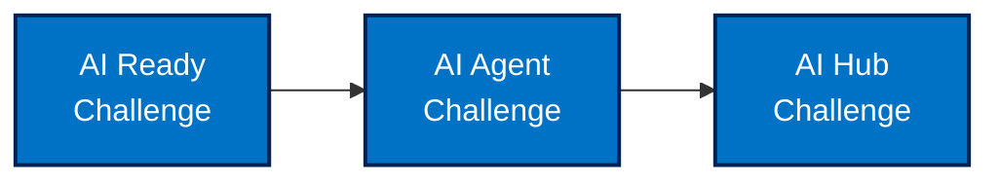

# Innovate Financial Services - AI Transformation

## Welcome to the IFS AI Transformation Workshop

This documentation contains materials for the Innovate Financial Services (IFS) AI transformation workshop. IFS is embarking on an ambitious journey to leverage Azure's AI capabilities to maintain market leadership, enhance customer trust, and improve operational efficiency.

## Workshop Objectives
The objectives of this workshop is to equip participants to analyze business needs, identify AI use cases, and formulate an AI strategy on Azure. Guide them in building an AI-ready platform, designing, integrating, and operationalizing trustworthy AI solutions.

## Workshop Structure

This workshop is divided into multiple challenge sessions that guide you through designing secure, scalable Azure architectures to support IFS's AI transformation:

### [Customer Story](./ifs-customer-story.md)
Understand IFS's background, challenges, and strategic vision for AI adoption.

### [AI Ready Challenge](./ai-ready-challenge.md)
Design a secure, scalable, and governed Azure foundation to support IFS's AI transformation journey.

### [AI Agent Challenge](./ai-agent-challenge.md)

## Documentation Resources

### [References](./references/index.md)
Centralized reference materials for all challenges.

### [Versioning Guide](./versioning-guide.md)
Information on how documentation versions and updates are managed.

### [Documentation Improvements](./documentation-improvements.md)
Summary of organization and structure improvements made to this documentation.
Design a secure internal Retrieval-Augmented Generation (RAG) chatbot application for IFS employees using agentic AI principles.

### [AI Hub Challenge](./ai-hub-challenge.md)
Design a dedicated, secure "AI Hub" environment to centrally manage and control access to shared Azure AI services.

### [Workshop](./04-workshop/)
Materials for organizing and running the IFS AI Transformation Workshop.

### [Azure Best Practices](./05-azure-best-practices/)
Comprehensive best practices and recommendations for deploying and managing Azure AI workloads, based on Microsoft's official guidance.

### [Documentation Standards](./documentation-standards.md)
Standards for file naming, document structure, and content formatting.

### [Frequently Asked Questions](./ifs-faq.md)
Common questions and answers about the workshop and IFS's AI journey.

## Challenge Sequence

The challenges are designed to be completed in sequence, building upon each other:

## About the Challenges

These challenge-based whiteboard design sessions provide a structured approach to designing modern AI solutions on Azure. Each challenge follows a step-by-step process:

1. **Understand the Customer**: Review business needs and success metrics
2. **Define Requirements**: Identify technical and business requirements
3. **Design Solutions**: Create architecture and select appropriate Azure services
4. **Present & Justify**: Explain your design decisions and how they address the requirements

## Workshop Date: April 2025

*This workshop is intended for learning purposes and represents a fictitious scenario for Innovate Financial Services.*