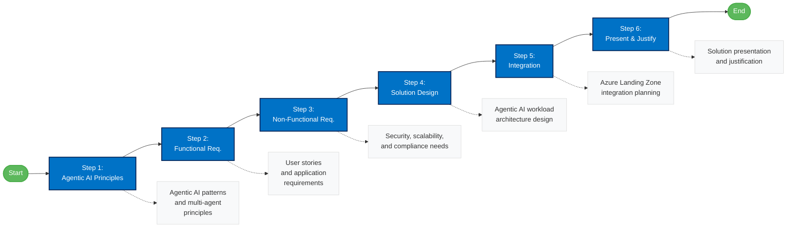

# Agentic AI Challenge

The Agentic AI Challenge guides you through designing a secure internal Retrieval-Augmented Generation (RAG) chatbot application for IFS employees.

This section focuses on creating a chatbot architecture that integrates with the existing Azure Landing Zones while meeting specific security and performance requirements.

## Challenge Steps

1. [Agentic AI Principles & Patterns](./02-rag/ifs-rag-step1-agentic-ai-principles.md)
2. [Functional Requirements](./02-rag/ifs-rag-step2-fr.md)
3. [Non-Functional Requirements](./02-rag/ifs-rag-step3-nfr.md)
4. [Solution Design](./02-rag/ifs-rag-step4-design.md)
5. [Integration](./02-rag/ifs-rag-step5-integrate.md)
6. [Present](./02-rag/ifs-rag-step6-present.md)

### Challenge Workflow

## Additional Resources

- [Overview](./02-rag/ifs-rag-overview.md)
- [References](./02-rag/ifs-rag-references.md)

## Navigation
- [⬅️ Back to Home](./index.md)
- [Customer Story](./ifs-customer-story.md)
- [AI Ready Challenge](./ai-ready-challenge.md)
- [AI Hub Challenge](./ai-hub-challenge.md)
